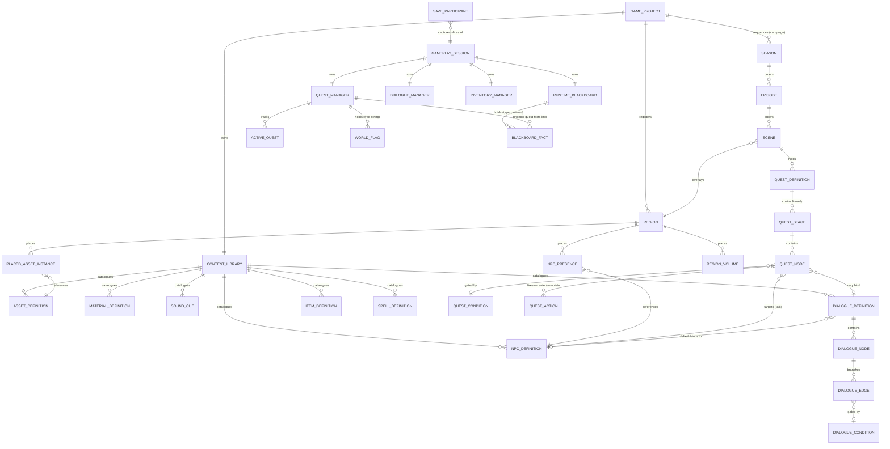

# Sugarmagic Domain Model

Status: active
Last verified against code: 2026-09-05

How the core sugarmagic entities fit together. This covers the core product
only -- the sugarlang plugin has its own model at
`packages/plugins/src/catalog/sugarlang/docs/api/domain-model.md`, and the
same separation applies to every plugin: core declares interfaces, plugins
supply implementations.

Deliberately not a module diagram. If this document and the code disagree,
the code is right and this is stale. Depth is uneven on purpose: the
gameplay and runtime clusters are documented to the field level because they
were verified line-by-line; the content and region clusters are documented
to the entity level.

---

## What sugarmagic is

One application where the authored region is the runtime region. Studio (the
authoring front end) and the shipped game are two front ends over the same
core packages: `domain` is the pure data model, `runtime-core` is the game,
`render-web` draws it. Everything the author creates is a **definition**;
everything the player changes is **runtime state**; the two never share a
store.

---

## The story timeline

**Story timeline** -- the ordered record of which narrative units have been
completed. The world at any point is DERIVED from that record and never
stored alongside it.

The narrative is containment: a game holds Seasons (`GameProject.seasons`),
a Season holds Episodes (`Season.episodes`), an Episode holds Scenes
(`Episode.scenes`), a Scene holds quests (`Scene.questDefinitions`).
Containment is by value, so a quest belongs to exactly one Scene, a Scene to
exactly one Episode, and an Episode to exactly one Season.

It is ordered by that containment and by quest start conditions, not by
wall clock. Two quests whose conditions do not reference each other have no
order between them, so this is a PARTIAL order rather than a sequence --
the one place it departs from event sourcing as normally described.

**Position on the timeline decides the world.** What the player sees is a
function of where they are: at a quest or its Scene, the region plus that
Scene's overlay; above the Scene tier, no overlay at all, which is the
region at rest. `composeRegionContents(region, scene | null)` computes
both -- a null Scene is the "above the Scene tier" answer, not a missing
value.

**Completion rolls up, and only quest completion is stored.**
`QuestManager`'s slice records which quests are finished. A Scene is complete
when every quest it holds is (`isSceneComplete`), and an Episode when every
Scene it holds is (`isEpisodeComplete`); both are computed on read from that
one recorded fact. A Scene holding no quests is complete vacuously. An
Episode holding no Scenes is not, because it cannot be entered, and calling
it finished would claim the player did something they had no way to do.

**The runtime can say "nothing is active".** `resolveActiveEpisode` returns
null once every unlocked Episode is finished and the next one is gated shut.
That is a real position on the timeline, above the Episode tier, not a failed
lookup -- and it is exactly the position a null Scene draws.

**Things elsewhere read the timeline rather than being contained by it.** A
resident who appears only after a quest, a barrier that opens at a stage,
an NPC behaviour that applies during one: each carries its own condition
(`RegionNPCPresence.condition`, `RegionVolumeDefinition.condition`,
`RegionNPCBehaviorTask.activation`, all `RegionBehaviorQuestBinding`) and
is composed onto a REGION. That is why such a change outlives the Episode
that triggered it: the region does.

`turn_timeline` (`runtime-core/src/turn-timeline`) uses "timeline" the same
way -- an ordered record of what happened -- against wall-clock
milliseconds within one conversation turn. Same shape, different scale, and
it is a diagnostic that is discarded after the turn rather than the thing
game state derives from.

### What the code does not do yet

Stated because this document describes the present: **a placed asset cannot
be conditioned.** Presences, volumes and behaviour tasks carry a condition;
`PlacedAssetInstance` does not. So "this statue exists after the festival"
has nowhere to live.

## The whole model

Read the labels as sentences: *a Region places NPC Presences*, *the Quest
Manager projects quest facts into the Runtime Blackboard*.

---

## Authored side

### Game Project and Content Library

`GameProject` (`packages/domain/src/game-project`) is the authored root: on
disk it is `project.sgrmagic` + `content-library.sgrmagic` +
`regions/*.json` + assets. It owns project settings, sound-event and music
bindings, credits, and the campaign (the `Season` list -- see Ordered and
gated below).

`ContentLibrary` (`packages/domain/src/content-library`) owns every reusable
definition: assets (with colliders), materials and textures, character
models and animation libraries, audio clips and sound cues, environment
lighting presets -- plus the NPC, dialogue, item and spell definitions
below. A definition owns what a thing IS; it never owns where the thing is
placed. Quests are the exception, and they are not catalogued at all: a
`QuestDefinition` is held by the Scene it happens in.

### Ordered and gated

Two words for the two independent things a narrative structure does. Every
doc, code comment and UI label uses them with exactly this meaning:

- **Seasons are ordered but not gated.** Order says which Season comes after
  which. Nothing holds the player back at a Season boundary.
- **Episodes are ordered and gated.** Order says which chapter comes after
  which. The unlock rule says whether the player may go there yet.
- **Scenes are ordered but not gated.** Order says which Scene comes after
  which inside the chapter. Nothing holds the player back -- finishing one
  moves them to the next.

So **ordered** is about sequence and **gated** is about permission. They are
separate: a thing can be ordered without being gated, which is exactly what a
Season and a Scene are. "Locked", "unlocked", "available" and "sequenced" are
not loose synonyms for either.

**A Season needs no gate of its own.** Narrative order across the campaign is
the concatenation of each Season's Episode list, in Season order; gating and
routing read that flat run and cannot see the grouping. Holding Season 2 back
until Season 1 finishes is done by gating Season 2's first Episode.

**Order is list position.** `GameProject.seasons` is ordered, each
`Season.episodes` is ordered, and each `Episode.scenes` is ordered. None
carries an order number: a stored ordinal beside an ordered list is the same
fact written twice, and the two drift the moment a delete leaves a hole.
Player-facing numbering ("Scene 3 of 5") derives from position, so it is
always contiguous from 1. A Scene that needs a fixed name like "Chapter 7"
puts it in `displayName`, which is a title, not an order. Because there is no
sort key to recover from, the load path never reorders -- `normalizeSeasons`,
`normalizeEpisodes` and `normalizeScenes` all preserve input order, and a
round-trip test pins it.

### Season, Episode, Region and Scene

`Season` (`packages/domain/src/seasons`) is a container and nothing else:
identity, display name, description, author notes, and an ordered list of
Episodes. It carries no gate, no title card and no completion rule -- all
three live on the Episode. A Season exists so a serial run of Episodes has a
name and a boundary.

A Season HOLDS its Episodes rather than naming them by id, so an Episode
belongs to exactly one Season by construction. Code that wants every Episode
without caring which Season owns it uses `getAllEpisodes(seasons)`;
`findSeasonById` and `findSeasonByEpisodeId` answer the lookup the other way.
Code that REWRITES Episodes or Scenes uses `mapEpisodes` or `mapScenes`,
which put every entry back where it came from -- rebuilding a campaign from a
flat Episode list is how Season membership gets silently collapsed.

**A Season is never empty.** Three authoring-session operations make that
true: adding a Season creates it already holding one Episode holding one
Scene, moving an Episode out refuses to empty its source, and deleting an
Episode is guarded on the owning Season's Episode count rather than the
project's. The last Season cannot be deleted either. Reordering an
Episode moves it inside its Season and stops at the Season's edges; changing
which Season owns an Episode is its own operation,
`moveEpisodeToSeasonInSession`.

A project file that carries no Seasons still loads as a campaign.
`normalizeGameProject` takes the first of these that is a NON-EMPTY list: the
authored `seasons`; else a flat `episodes` list from before Seasons existed,
wrapped in one Season with the fixed id `season:default`; else one
synthesized Season holding one Episode holding one Scene, so Studio always
has a Scene to author against. Non-empty rather than merely present is the
load-bearing part: a file carrying `seasons: []` beside a real `episodes`
list has to fall through to the wrap, or it would load as an empty campaign.

`Episode` (`packages/domain/src/episodes`) holds an ordered run of Scenes plus
the gate that decides when the player may enter it (`always`, `manual`,
`questComplete`, `wallClock`). An Episode HOLDS its Scenes rather than naming
them by id, so a Scene belongs to exactly one Episode by construction. The
Scene lookups take an Episode list, so a caller holding a project reaches
them through `getAllEpisodes`: `getAllScenes(getAllEpisodes(project.seasons))`
and `findSceneById(getAllEpisodes(project.seasons), id)`.
`mapScenesInEpisodes` rewrites the Scenes inside one Episode list; a
campaign-wide rewrite wants `mapScenes` above, which keeps every Episode in
the Season that owns it.

`Region` (`packages/domain/src/region-authoring`) is the authored place:
placed asset instances, placed lights, landscape, environment, and the
region-local gameplay placements -- `RegionNPCPresence` (which NPC exists
here, optionally conditioned by a quest binding: quest active / stage /
world-flag equals) and region volumes whose trigger actions can set world
flags and play audio on entry.

`PlacedLight` is a light an author put in the world, as distinct from the
environment's sun, which stays a property of the environment. It is one of
`point`, `spot` or `area` -- the same three Blender offers -- and the kind
decides which fields it carries: reach for point and spot, cone angle and
softness for spot, panel size for area. Anything the kind does not use is
null, and `createPlacedLight` is the only constructor, so a point light
holding a cone cannot be built.

`enabled` is authored, not an editor convenience: a light switched off is
absent from the shipped game, not merely hidden while authoring. `modulation`
names how the light moves over time -- `steady`, `flame`, `candle` or `pulse`
-- with a seed that keeps two candles in one room from flickering in step; it
is sampled as a pure function of elapsed seconds, so nothing about phase
persists. A spot light may name a library texture to shine through, which is
how a window throws a window-shaped pool.

Lights compose exactly as placed assets do: a Scene overlay adds its own and
can suppress the region's, and `composeRegionContents` is the only view any
consumer should read.

`Scene` (`packages/domain/src/scenes`) is one place with the overlays that
dress it for this part of the story: content additions/overrides, environment
and audio overrides, a title card. It also holds the quests that happen there
(`Scene.questDefinitions`), by value, the way an Episode holds its Scenes. It
carries no order number and no gate of its own. Quest actions drive
progression -- `advanceToNextScene` moves within an Episode (and running off
the end is the Episode boundary, where credits roll), `unlockEpisode` opens a
gate. Viewport and runtime always resolve region + active scene overlay
composed, never the base region alone.

`GameProject.episodeEndRouting` decides where the player goes when an Episode
ends: `episodes-screen` (the default) hands them the Episodes screen to
choose; `next-episode` continues into the next Episode when its gate is open,
falling back to the same screen when it is shut, so a gated Episode is never
a dead end.

### NPC, Dialogue, Item, Spell

`NPCDefinition` (`packages/domain/src/npc-definition`) carries display,
presentation profile, animation bindings, lore page reference,
`recoveryStrategies`, and `interactionMode: "scripted" | "agent"`.
`recoveryStrategies` is an ordered list of `{ strategy, note }` saying what the
character does when it cannot understand the player; the order is what it
reaches for first, and an empty list means it talks about itself. The mode is a static property of
the definition: `scripted` NPCs only converse through a bound
`DialogueDefinition`; `agent` NPCs converse through the sugaragent pipeline.

`DialogueDefinition` (`packages/domain/src/dialogue-definition`) is a node
graph: nodes hold speaker + line (+ optional line intent), edges branch and
may carry a `DialogueCondition` (flag / item / spell / quest state). An
`interactionBinding` names the NPC this dialogue default-binds to.

`startNodeId` is the node a conversation opens from, and is `string | null`: a
dialogue may be emptied completely, which is a legitimate way to start over, and
then there is nowhere to start. Deleting the start node repoints it at whatever
remains, so it never names a node that is gone.

`ItemDefinition` and `SpellDefinition` are catalog entries consumed by the
runtime inventory and caster.

### Quest

`QuestDefinition` (`packages/domain/src/quest-definition`) lives on the Scene
that holds it. Most consumers -- the runtime's quest manager, the deploy
bundle, validation -- want every quest and do not care which Scene owns
which, and read the flat view derived on demand by
`getAllQuestDefinitionsInEpisodes` / `findQuestDefinitionById` in
`episodes/`. A definition is:

- **Stages chain linearly.** `startStageId` + per-stage `nextStageId`.
  A stage is "a scene at a time": it may pin `timeOfDay`, applied to the
  world clock when the stage becomes active.
- **Nodes form a DAG inside a stage.** Edges are `prerequisiteNodeIds` on
  the node (plus stage `entryNodeIds` and branch `failTargetNodeIds`);
  there is no separate edge entity.
- **Node behaviors:** `objective` (subtypes talk / location / collect /
  castSpell / assessment / awaitEvent), `narrative` (subtypes voiceover /
  dialogue / cutscene, of which only dialogue does anything yet),
  `condition` (completes when its `QuestConditionDefinition` becomes true),
  `branch` (evaluates its condition immediately; fail activates
  `failTargetNodeIds`).
- **Conditions:** hasFlag / hasSpell / canCastSpell / questActive /
  questCompleted / questStage / not. No and/or combinators.
- **A flag condition always names a value, and the comparison is `===`.**
  There is no "is this flag set at all" form: an unset flag fails every
  comparison, so presence needs no separate rule. A blank value is refused in
  the quest editor, which flags the field and lists the node in the Validation
  panel; `isBlankFlagValue` is the shared check.
- **Authored flag values are coerced on both sides.** `coerceAuthoredFlagValue`
  runs on the `setFlag` action's value and on the `hasFlag` condition's value,
  so `"true"` becomes `true` and `"5"` becomes `5` at both ends and equality
  holds. Without it the action stores boolean `true` while the condition stores
  the string `"true"`, and the condition never matches. Region flag conditions
  (`RegionBehaviorWorldFlagCondition`) carry a declared `valueType` and reach
  the same guarantee through `coerceWorldFlagValue`, which is now the single
  read-and-write coercion.
- **Actions:** `onEnterActions` / `onCompleteActions` lists of
  `QuestActionDefinition`, a discriminated union on `type` where each
  variant declares its own named fields: setFlag, emitEvent, giveItem,
  removeItem, unlockEpisode, advanceToNextScene, set-time-of-day,
  advance-day, learn-fact, playCue, playAnimation. Every one is consumed
  at runtime.
- Nodes carry `graphPosition` for the quest graph editor, `showInHud`,
  `optional`, `eventName` (named completion event), and for talk/dialogue
  nodes a `dialogueDefinitionId` + `completeOn`.

### Graph layout

The three documents edited as node graphs -- `QuestStageDefinition`,
`DialogueDefinition` and `ShaderGraphDocument` -- each carry an optional
`groups: NodeGroup[]` (`packages/domain/src/graph-layout`). A `NodeGroup` is a
labelled box drawn around a set of nodes: `groupId`, `label`, `memberNodeIds`,
`position` and its own `size`.

Groups are layout, not meaning. The runtime never reads them, and grouping nodes
changes nothing about how a quest, dialogue or shader behaves.

Membership lives only on the group, in `memberNodeIds`; a node does not name its
group. Node positions stay absolute in the document -- the editor converts to and
from box-relative coordinates, because the graph library positions a member
relative to the box it sits in.

The field is optional so a document written before groups existed loads without
migration; the normalizers default it to an empty list and drop members whose
nodes no longer exist.

### Authoring change path

All authored mutation flows through semantic commands
(`packages/domain/src/commands`, dispatched from Studio as
`SemanticCommand`s like `UpdateQuestDefinition`), with transactions and
history alongside. UI never mutates definitions directly.

Saving runs `validateProjectContent(gameProject, regions, contentLibrary)`
(`packages/domain/src/content-validation`). It takes the content library
because some references point out of a region and into it -- a spot light
naming a texture to shine through, for one -- and a check that cannot see the
library cannot tell a live reference from a dangling one. Errors stop the
save; warnings do not.

---

## Runtime side

`gameplay-session.ts` (`packages/runtime-core/src/coordination`) is the
wiring hub: it constructs the managers, connects their handler seams, and
owns every cross-system bridge described below.

### Quest runtime

`QuestManager` (`packages/runtime-core/src/quest`) holds active quests as
per-stage, per-node progress (`inactive | active | completed` +
`branchResult`). A quest with no `startCondition` starts at session start;
one with a condition starts when it holds, which `update()` re-checks as
quest and flag state moves. There is no accept step -- a quest granted by
an NPC is one whose start condition reads a flag that NPC's dialogue sets.
A fixed-point refresh loop activates nodes
whose prerequisites completed, completes condition/collect/branch nodes,
and advances the stage when every non-optional node is completed or
unreachable. External completions arrive by notification: dialogue finished
(talk/dialogue nodes, honoring `completeOn`), spell cast, and named events
(`notifyEvent` matches `node.eventName`). A stage with no `nextStageId`
completes the quest.

Quest-dialogue coordination: an active talk objective with a
`dialogueDefinitionId` overrides the NPC's dialogue for a `scripted` NPC,
and rides into a free-form conversation as
`scriptedFollowupDialogueDefinitionId` for an `agent` NPC. NPCs that are
talk targets of some quest have no default dialogue until a quest offers
one.

### World state: two stores

`RuntimeBlackboard` (`packages/runtime-core/src/state/blackboard.ts`) is
the typed fact store: every fact is a registered
`BlackboardFactDefinition` with an owner system, allowed scopes (global /
region / entity / quest / conversation), and a lifecycle (session / frame /
ephemeral). Writes by a non-owner throw. Producers: spatial, movement,
behavior, world-time, player-facts, narrative systems, and the quest-fact
projection (tracked quest, active stage, active objectives). Consumers:
`buildConversationRuntimeContext` snapshots facts into the runtime context
handed to plugins -- plugins never hold a blackboard handle; they request
writes through the conversation action proposal channel. Plugins may
contribute their own fact definitions.

**World flags** are the author-facing store, owned by `WorldFlagManager`
(`runtime-core/src/world-flags/`) and persisted in their own save slice.
Written by quest `setFlag` actions, volume triggers, spell `world-flag`
effects and conversation proposals; read by quest conditions, dialogue
conditions, NPC presence gating, NPC behavior activation and containment
volume gates.

Authored content names a flag by `definitionId`, resolved against
`GameProject.worldFlagDefinitions` -- the registry that makes the set of flags
a closed, validated one rather than free strings that silently never match.
The runtime store is keyed by the flag's `name`, because the paths that can
only name a flag in a string (a conversation proposal, the dev console) cannot
produce an id.

Flags are also projected onto the blackboard as `world.flag` facts, one per
flag, scoped by name, so a narrative system can read them without holding the
store. `WorldFlagManager` stays the write and persistence home; the blackboard
copy is a projection, per [ADR 031](../adr/031-blackboard-is-a-projection-surface.md).
Only registered flags are projected.

### Events

There is no general event bus. `QuestRuntimeEvent` (quest-start /
stage-advance / quest-complete / objective-complete) fans out from one
handler to notifications, the recent-event ring buffer (last 10, feeds NPC
conversation context), and audio. Named quest node events are a matching
pass, not a subscription: `notifyEvent(name)` completes active nodes whose
`eventName` matches.

### Persistence

Per-player runtime state persists as `SaveParticipant` slices (Plan 055
memento pattern). **This table is the canonical list; other docs link here
rather than restating it.**

| participant id | what it holds | owner |
|---|---|---|
| `quest.manager` | active + completed quests, completed nodes, tracked quest | runtime-core |
| `world.flags` | the world flag store | runtime-core |
| `world.time` | clock band + day | runtime-core |
| `world.presence` | which item presences the player has collected, keyed region -> scene | runtime-core |
| `player.known-facts` | facts the player has learned | runtime-core |
| `inventory.player` | the player's inventory | runtime-core |
| `npc.behavior` | per-NPC behavior state | runtime-core |
| `npc.interaction-mode` | quest-set overrides of an NPC's scripted/agent mode | runtime-core |
| `caster.stats` | caster stats | runtime-core |
| `playthrough.identity` | which playthrough this save is | runtime-core |
| `host.player` | current region + player position | web host |
| `campaign.progression` | current Episode and Scene, manually unlocked Episodes | web host |

Plugins contribute their own participants on top (sugarlang's target
language, for example).

`campaign.progression` names no Season and records no completion. The Season
the player is in is found from the current Episode (`findSeasonByEpisodeId`),
and completion is derived from the quests in `quest.manager`; storing either
would be the same fact written twice. `unlockedEpisodeIds` holds only the
unlocks gameplay granted outright, because the gates that read state --
`always`, `questComplete`, `wallClock` -- are evaluated fresh at every boot,
so retuning a gate never strands a player.

Each slice carries a `schemaVersion`. Two patterns exist and the choice is
per-slice: **upgrade in place** when the old shape still means something
(`world.presence` v1 -> v2 wraps pre-Scenes collections under the default
Scene), or **discard** when it does not (`campaign.progression` v1 was
Scene-gated, and Scenes stopped being gated, so there is nothing to convert
-- a v1 save keeps every other slice and restarts the campaign).

The blackboard itself is never persisted; participant stores re-project
their facts into it on restore. Quest restore drops quests whose
definition no longer exists and re-fires state-change (not events) so
derived consumers resync without re-toasting.
