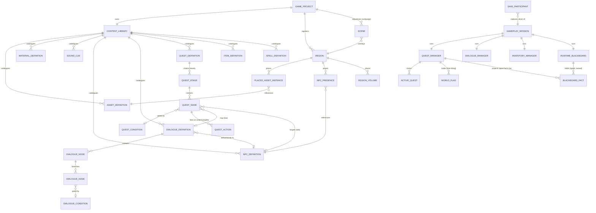

# Sugarmagic Domain Model

Status: active
Last verified against code: 2026-08-18

How the core sugarmagic entities fit together. This covers the core product
only -- the sugarlang plugin has its own model at
`packages/plugins/src/catalog/sugarlang/docs/api/domain-model.md`, and the
same separation applies to every plugin: core declares interfaces, plugins
supply implementations.

Deliberately not a module diagram. If this document and the code disagree,
the code is right and this is stale. Depth is uneven on purpose: the
gameplay and runtime clusters are documented to the field level because they
were verified line-by-line; the content and region clusters are documented
to the entity level.

---

## What sugarmagic is

One application where the authored region is the runtime region. Studio (the
authoring front end) and the shipped game are two front ends over the same
core packages: `domain` is the pure data model, `runtime-core` is the game,
`render-web` draws it. Everything the author creates is a **definition**;
everything the player changes is **runtime state**; the two never share a
store.

---

## The whole model

Read the labels as sentences: *a Region places NPC Presences*, *the Quest
Manager projects quest facts into the Runtime Blackboard*.

---

## Authored side

### Game Project and Content Library

`GameProject` (`packages/domain/src/game-project`) is the authored root: on
disk it is `project.sgrmagic` + `content-library.sgrmagic` +
`regions/*.json` + assets. It owns project settings, sound-event and music
bindings, credits, and the campaign (the ordered `Scene` list with unlock
progression).

`ContentLibrary` (`packages/domain/src/content-library`) owns every reusable
definition: assets (with colliders), materials and textures, character
models and animation libraries, audio clips and sound cues, environment
lighting presets -- plus the gameplay definitions below. A definition owns
what a thing IS; it never owns where the thing is placed.

### Region and Scene

`Region` (`packages/domain/src/region-authoring`) is the authored place:
placed asset instances, landscape, environment, and the region-local
gameplay placements -- `RegionNPCPresence` (which NPC exists here, optionally
gated by a quest binding: quest active / stage / world-flag equals) and
region volumes whose trigger actions can set world flags and play audio on
entry.

`Scene` (`packages/domain/src/scenes`) is an episode overlay on a region:
content additions/overrides, environment and audio overrides, unlock
conditions, transitions. The campaign sequences Scenes; quest actions
(`unlockScene`, `advanceToNextScene`) drive progression through them.
Viewport and runtime always resolve region + active scene overlay composed,
never the base region alone.

### NPC, Dialogue, Item, Spell

`NPCDefinition` (`packages/domain/src/npc-definition`) carries display,
presentation profile, animation bindings, lore page reference, and
`interactionMode: "scripted" | "agent"`. The mode is a static property of
the definition: `scripted` NPCs only converse through a bound
`DialogueDefinition`; `agent` NPCs converse through the sugaragent pipeline.

`DialogueDefinition` (`packages/domain/src/dialogue-definition`) is a node
graph: nodes hold speaker + line (+ optional line intent), edges branch and
may carry a `DialogueCondition` (flag / item / spell / quest state). An
`interactionBinding` names the NPC this dialogue default-binds to.

`ItemDefinition` and `SpellDefinition` are catalog entries consumed by the
runtime inventory and caster.

### Quest

`QuestDefinition` (`packages/domain/src/quest-definition`) is:

- **Stages chain linearly.** `startStageId` + per-stage `nextStageId`.
  A stage is "a scene at a time": it may pin `timeOfDay`, applied to the
  world clock when the stage becomes active.
- **Nodes form a DAG inside a stage.** Edges are `prerequisiteNodeIds` on
  the node (plus stage `entryNodeIds` and branch `failTargetNodeIds`);
  there is no separate edge entity.
- **Node behaviors:** `objective` (subtypes talk / location / collect /
  trigger / castSpell / assessment / custom), `narrative` (subtypes
  voiceover / dialogue / cutscene / event), `condition` (completes when its
  `QuestConditionDefinition` becomes true), `branch` (evaluates its
  condition immediately; fail activates `failTargetNodeIds`).
- **Conditions:** hasFlag / hasSpell / canCastSpell / questActive /
  questCompleted / questStage / not. No and/or combinators.
- **Actions:** `onEnterActions` / `onCompleteActions` lists of
  `QuestActionDefinition` (setFlag, giveItem, removeItem, emitEvent,
  unlockScene, advanceToNextScene, set-time-of-day, advance-day,
  learn-fact are consumed at runtime; playSound, spawnVfx, teleportNpc,
  moveNpc, setNpcState are authorable but currently have no runtime
  consumer).
- Nodes carry `graphPosition` for the quest graph editor, `showInHud`,
  `optional`, `eventName` (named completion event), and for talk/dialogue
  nodes a `dialogueDefinitionId` + `completeOn`.

### Graph layout

The three documents edited as node graphs -- `QuestStageDefinition`,
`DialogueDefinition` and `ShaderGraphDocument` -- each carry an optional
`groups: NodeGroup[]` (`packages/domain/src/graph-layout`). A `NodeGroup` is a
labelled box drawn around a set of nodes: `groupId`, `label`, `memberNodeIds`,
`position` and its own `size`.

Groups are layout, not meaning. The runtime never reads them, and grouping nodes
changes nothing about how a quest, dialogue or shader behaves.

Membership lives only on the group, in `memberNodeIds`; a node does not name its
group. Node positions stay absolute in the document -- the editor converts to and
from box-relative coordinates, because the graph library positions a member
relative to the box it sits in.

The field is optional so a document written before groups existed loads without
migration; the normalizers default it to an empty list and drop members whose
nodes no longer exist.

### Authoring change path

All authored mutation flows through semantic commands
(`packages/domain/src/commands`, dispatched from Studio as
`SemanticCommand`s like `UpdateQuestDefinition`), with transactions and
history alongside. UI never mutates definitions directly.

---

## Runtime side

`gameplay-session.ts` (`packages/runtime-core/src/coordination`) is the
wiring hub: it constructs the managers, connects their handler seams, and
owns every cross-system bridge described below.

### Quest runtime

`QuestManager` (`packages/runtime-core/src/quest`) holds active quests as
per-stage, per-node progress (`inactive | active | completed` +
`branchResult`). Every loaded quest auto-starts at session start; there is
no quest-giver or accept step. A fixed-point refresh loop activates nodes
whose prerequisites completed, completes condition/collect/branch nodes,
and advances the stage when every non-optional node is completed or
unreachable. External completions arrive by notification: dialogue finished
(talk/dialogue nodes, honoring `completeOn`), spell cast, and named events
(`notifyEvent` matches `node.eventName`). A stage with no `nextStageId`
completes the quest.

Quest-dialogue coordination: an active talk objective with a
`dialogueDefinitionId` overrides the NPC's dialogue for a `scripted` NPC,
and rides into a free-form conversation as
`scriptedFollowupDialogueDefinitionId` for an `agent` NPC. NPCs that are
talk targets of some quest have no default dialogue until a quest offers
one.

### World state: two stores

`RuntimeBlackboard` (`packages/runtime-core/src/state/blackboard.ts`) is
the typed fact store: every fact is a registered
`BlackboardFactDefinition` with an owner system, allowed scopes (global /
region / entity / quest / conversation), and a lifecycle (session / frame /
ephemeral). Writes by a non-owner throw. Producers: spatial, movement,
behavior, world-time, player-facts, narrative systems, and the quest-fact
projection (tracked quest, active stage, active objectives). Consumers:
`buildConversationRuntimeContext` snapshots facts into the runtime context
handed to plugins -- plugins never hold a blackboard handle; they request
writes through the conversation action proposal channel. Plugins may
contribute their own fact definitions.

**World flags** are the author-facing store and are NOT blackboard facts:
`QuestManager.runtimeFlags` is a free-string map written by quest `setFlag`
actions, volume triggers, mechanics effects, and conversation proposals,
and read by quest conditions, dialogue conditions, NPC presence gating, and
NPC behavior activation. Flag names are unvalidated strings; a typo between
writer and reader silently never matches. Flags persist in the quest save
slice. This split (typed owned facts vs free author flags) is current
reality, not a design ideal -- unifying it is open work.

### Events

There is no general event bus. `QuestRuntimeEvent` (quest-start /
stage-advance / quest-complete / objective-complete) fans out from one
handler to notifications, the recent-event ring buffer (last 10, feeds NPC
conversation context), and audio. Named quest node events are a matching
pass, not a subscription: `notifyEvent(name)` completes active nodes whose
`eventName` matches.

### Persistence

Per-player runtime state persists as `SaveParticipant` slices (Plan 055
memento pattern): quest manager (progress + flags + tracked), world time,
player known facts, NPC behavior, caster stats, and plugin participants.
The blackboard itself is never persisted; participant stores re-project
their facts into it on restore. Quest restore drops quests whose
definition no longer exists and re-fires state-change (not events) so
derived consumers resync without re-toasting.
