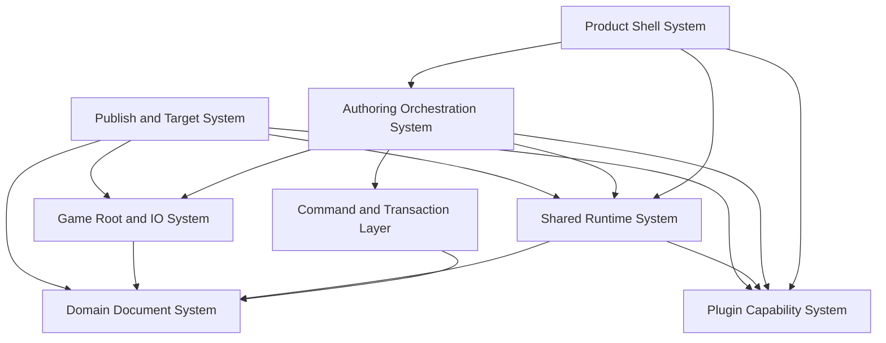
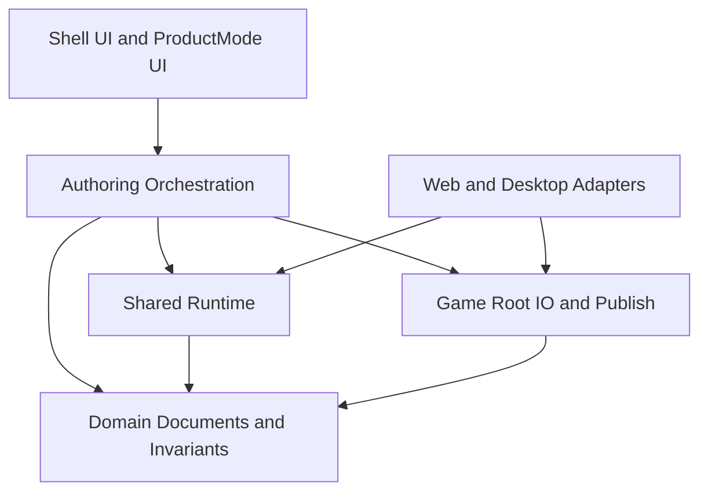
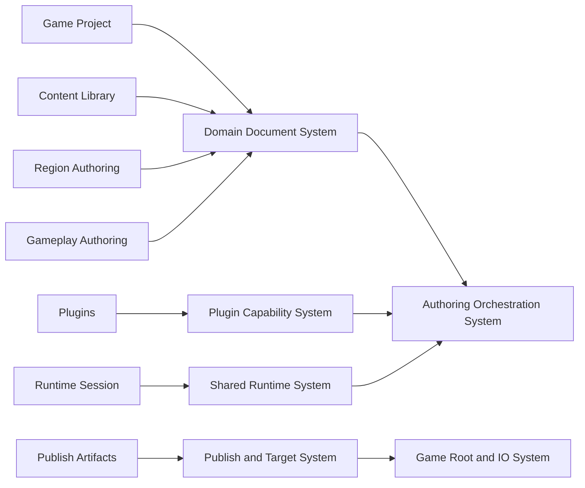
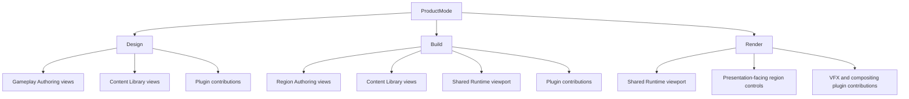
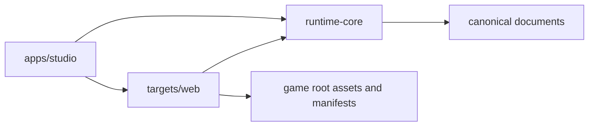
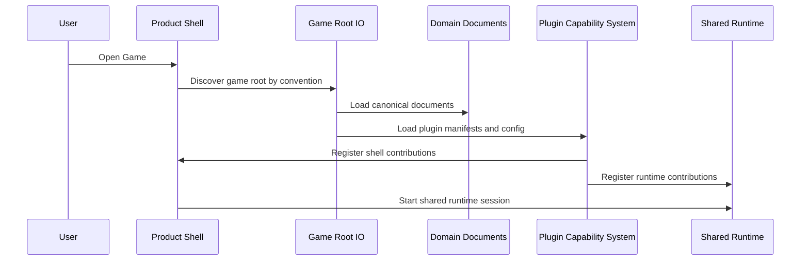
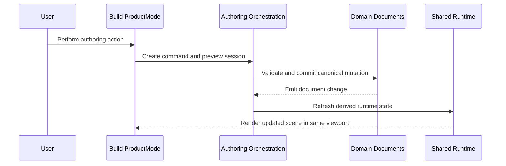
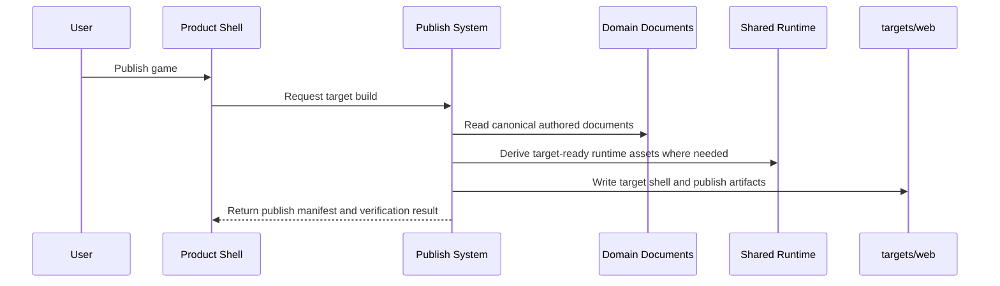

# Proposal 005: Sugarmagic System Architecture

**Status:** Proposed
**Date:** 2026-03-31

## Summary

Sugarmagic needs a final-form system architecture that unifies the strongest parts of Sugarbuilder and Sugarengine without carrying forward their split-brain structure.

This proposal defines the start of that architecture.

It proposes:

- the top-level system decomposition for Sugarmagic
- the file and folder layout for the Sugarmagic repo
- the major runtime, authoring, plugin, and publish boundaries
- the relationship between canonical authored documents and derived runtime artifacts
- the extracted shared runtime shape for web targets
- the preserved game-root and publish contracts

This document is intentionally:

- high level
- system-oriented
- derived from the domain proposals
- independent of detailed store shape
- independent of final TypeScript interfaces

The goal is to define the permanent home for the product before implementation starts to harden around accidental boundaries.

## Relationship to Existing Proposals

This proposal builds directly on:

- [Proposal 001: Sugarbuilder + Sugarengine Unification](/Users/nikki/projects/sugarmagic/docs/proposals/001-sugarbuilder-sugarengine-unification.md)
- [Proposal 002: Sugarmagic Domain Model](/Users/nikki/projects/sugarmagic/docs/proposals/002-sugarmagic-domain-model.md)
- [Proposal 003: Sugarmagic Region Document Model](/Users/nikki/projects/sugarmagic/docs/proposals/003-region-document-model.md)
- [Proposal 004: Sugarmagic ProductMode Shell](/Users/nikki/projects/sugarmagic/docs/proposals/004-productmode-shell.md)
- [Proposal 008: Command and Transaction Architecture](/Users/nikki/projects/sugarmagic/docs/proposals/008-command-and-transaction-architecture.md)
- [Proposal 009: Material Compilation and Shader Pipeline Architecture](/Users/nikki/projects/sugarmagic/docs/proposals/009-material-compilation-and-shader-pipeline.md)

This proposal does **not** add a new top-level domain concept.

It stays within the domain model already defined and describes how the system should be de-composed from that model.

## Why This Proposal Exists

Sugarmagic will fail if it recreates either of these patterns:

- Sugarbuilder's tendency toward editor-specialized systems that later need runtime parity work
- Sugarengine's tendency toward a strong runtime core with editor features layered unevenly around it

The final architecture must instead satisfy the non-negotiable rules from [AGENTS.md](/Users/nikki/projects/sugarmagic/AGENTS.md):

- one source of truth
- single enforcer
- one-way dependencies
- one type per behavior
- goals must be verifiable

This proposal translates those rules into a concrete repo shape and a concrete system map.

One important clarification:

- published web targets should share runtime architecture with Sugarmagic
- published web targets should not be assumed to share the Sugarmagic editor shell visual system
- game-specific UI remains distinct from editor-shell UI unless a later proposal explicitly defines a shared game-facing UI layer

## Technology and State Management Direction

This proposal remains architecture-first, but the foundation should still assume a small number of implementation choices.

- TypeScript is the primary language
- modern ESM boundaries are the default module style
- Vite-compatible tooling is the default host/target build direction
- `zustand` is the default store technology for shell-facing and authoring-session-facing application state

For the first authored-loop milestone, the implementation direction should also assume:

- browser-first project lifecycle support
- Chromium-class desktop browsers as the first supported environment
- File System Access API as the primary way to access canonical game roots from the browser host
- OPFS only for non-canonical cached or disposable data where useful

This milestone should not require Tauri just to achieve project open/save flows.

### Important rule

`zustand` is not the canonical owner of authored truth.

It belongs in:

- product shell state
- ProductMode state
- navigation and panel state
- selection and tool-session coordination state

It does not replace:

- domain documents as authored truth
- command/transaction boundaries as the canonical mutation path
- runtime session systems as owners of live play state

### Placement guideline

The intended ownership split is:

- local component state for strictly local presentation behavior
- `zustand` for shell and authoring-session coordination
- domain documents for canonical authored truth
- runtime session systems for live simulation truth
- sidecars and caches for durable convenience state that is safe to delete

### Lifetime guideline

The architecture should also make lifetime explicit:

- local UI state should remain component-local
- tool interaction state should remain session-scoped
- shell/application coordination state should remain ProductMode- or workspace-scoped
- runtime simulation state should remain runtime-session-scoped

This is necessary to avoid cross-mode state bleed and surprising restoration behavior.

## Architectural North Star

Sugarmagic should be one product with:

- one application shell
- one canonical game-root model
- one canonical project and region document model
- one runtime scene/material/landscape/environment implementation
- one semantic material compiler with profile-aware outputs
- one plugin capability system
- one publish pipeline that derives target artifacts from canonical authored truth

The editor should sit on top of the runtime.

The runtime should not have to "catch up" to the editor.

## Primary Constraints

The architecture must preserve and strengthen these decisions from prior work.

### 1. The game root remains canonical

Sugarmagic should preserve the game-root rules established in Sugarengine:

- game roots are opened directly
- authored paths are root-relative
- title content belongs to the game root, not the tool repo
- published paths are derived later

This follows:

- [ADR 025: Multi-Project Game Architecture](/Users/nikki/projects/sugarengine/docs/adr/025-multi-project-architecture.md)
- [ADR 026: Game Root Lifecycle and External Game Discovery](/Users/nikki/projects/sugarengine/docs/adr/026-game-root-lifecycle-and-external-game-discovery.md)

### 2. The authored view must be the runtime view

Sugarmagic should preserve the core lesson from the Sugarbuilder → Sugarengine parity work:

- runtime-visible features are implemented directly in the shared runtime
- editing overlays sit above that runtime
- export and publish derive artifacts, but they are not the normal source of truth during authoring

This follows:

- [ADR 063: Sugarbuilder to Sugarengine Runtime Parity Export Contract](/Users/nikki/projects/sugarbuilder/docs/adr/ADR-063-SUGARENGINE-RUNTIME-PARITY-EXPORT-CONTRACT.md)

### 3. Asset and material authoring should remain explicit and layered

Sugarmagic should keep the strongest architectural lessons from Sugarbuilder's asset/material work:

- imported geometry remains distinct from authored assembly metadata
- slot and surface semantics remain explicit
- projection-based mapping remains explicit
- editing documents remain canonical for authored changes, while imported assets remain source material

This follows:

- [ADR 057: Project-Root Asset Import Architecture](/Users/nikki/projects/sugarbuilder/docs/adr/057-project-root-asset-import-architecture.md)
- [ADR 059: Asset Editing Mode Architecture](/Users/nikki/projects/sugarbuilder/docs/adr/ADR-059-ASSET-EDITING-MODE-ARCHITECTURE.md)
- [ADR 060: Asset Surface Region Domain Model](/Users/nikki/projects/sugarbuilder/docs/adr/ADR-060-ASSET-SURFACE-REGION-DOMAIN-MODEL.md)
- [ADR 061: Projection-Based Surface Mapping](/Users/nikki/projects/sugarbuilder/docs/adr/ADR-061-PROJECTION-BASED-SURFACE-MAPPING.md)
- [ADR 062: Slot-Driven Asset Material Authoring](/Users/nikki/projects/sugarbuilder/docs/adr/ADR-062-SLOT-DRIVEN-ASSET-MATERIAL-AUTHORING.md)

### 4. Landscape, VFX, and environment stay runtime-real

Sugarmagic should preserve the lessons from both repos:

- splatmap landscape is a runtime system, not an editor-only fake
- VFX is a first-class runtime subsystem with authoring hooks
- sky, clouds, post, and environment are runtime-owned and editor-controlled

This follows:

- [ADR 029: Splatmap-Based Ground System](/Users/nikki/projects/sugarbuilder/docs/adr/029-splatmap-ground-system.md)
- [ADR 013: VFX System](/Users/nikki/projects/sugarengine/docs/adr/013-vfx-system.md)

### 5. Plugins remain optional capabilities

Sugarmagic should preserve the plugin lesson from Sugarengine:

- optional systems register capabilities through a clear contract
- plugins extend the product without silently becoming new domain owners

This follows:

- [ADR 024: Plugin Architecture for Optional Systems](/Users/nikki/projects/sugarengine/docs/adr/024-plugin-architecture.md)

## System Architecture Overview

Sugarmagic should be composed from seven major systems.

These systems map to the domain model, but not one-to-one.

Some systems are domain-owning.
Some systems are compositional.
Some systems are delivery-oriented.



### System 1: Product Shell System

**Purpose:**
Provide the top-level application shell and compose `ProductMode`.

**Owns:**

- application bootstrapping
- top navigation
- `ProductMode` switching
- workspace hosting and activation
- shell/app-state coordination
- shell layout regions
- shared viewport hosting
- shared inspector hosting
- shared notifications and command surfaces

**Does not own:**

- canonical domain truth
- region logic
- gameplay logic
- rendering semantics

**Composes:**

- `Design` ProductMode
- `Build` ProductMode
- `Render` ProductMode

This system exists because [Proposal 004: Sugarmagic ProductMode Shell](/Users/nikki/projects/sugarmagic/docs/proposals/004-productmode-shell.md) defines `ProductMode` as a shell concept, not a domain concept.

Local UI component state may still exist inside this system, but only for strictly local presentation concerns.

Camera and viewport context should normally be treated as workspace/viewport state owned by shell/orchestration coordination, not as app-global state.

### System 2: Authoring Orchestration System

**Purpose:**
Coordinate user intent into commands, transactions, preview updates, undo/redo, and tool sessions.

**Owns:**

- use cases
- semantic commands
- transaction boundaries
- undo/redo history
- selection context
- tool sessions
- authoring-session store coordination
- workspace-scoped coordination
- preview-versus-commit behavior
- validation before commit

**Pattern bias:**

- `Command`
- `State`
- `Observer`
- `Facade`

This system should inherit the strongest lessons from [ADR 056: Layout Interaction Architecture](/Users/nikki/projects/sugarbuilder/docs/adr/056-layout-interaction-architecture.md):

- tool controllers own sessions
- selection is centralized
- preview is separate from commit
- snapping is a service, not a side effect

The `Authoring Orchestration System` is the only permitted path for canonical authored mutation.

UI, tools, runtime preview systems, and plugins must not mutate canonical documents directly.
They must go through the command and transaction boundary defined in [Proposal 008: Command and Transaction Architecture](/Users/nikki/projects/sugarmagic/docs/proposals/008-command-and-transaction-architecture.md).

Store-backed application state belongs here only as coordination state.

It must not turn this system into a second owner of canonical authored truth.

It should also own the rules for entering and exiting tool sessions and ProductModes cleanly so transient state does not bleed across boundaries.

### System 3: Domain Document System

**Purpose:**
Own the canonical authored documents and domain invariants.

**Owns:**

- `Game Project`
- `Content Library`
- `Region Authoring`
- `Gameplay Authoring`
- `Plugins`
- `Publish Artifacts` definitions as derived specifications

**Canonical documents include:**

- game project document
- region documents
- shared content documents
- gameplay documents
- plugin configuration documents

**Important rule:**
This system owns authored truth, but it does **not** own runtime scene instances.

That boundary keeps authored documents stable and keeps runtime state derived.

### System 4: Shared Runtime System

**Purpose:**
Render, simulate, and preview the authored world.

**Owns:**

- scene assembly
- region loading
- material graph runtime
- landscape runtime
- sky and atmosphere runtime
- VFX runtime
- UI-facing preview simulation
- playtest runtime session behavior
- plugin runtime hook points

**Important rule:**
This runtime is shared by:

- the `Build` ProductMode viewport
- the `Render` ProductMode viewport
- local playtest
- published web targets

There is one authored rendering model.

There is not a separate editor renderer and game renderer.

This is the direct architectural consequence of [ADR 063](/Users/nikki/projects/sugarbuilder/docs/adr/ADR-063-SUGARENGINE-RUNTIME-PARITY-EXPORT-CONTRACT.md).

### System 5: Plugin Capability System

**Purpose:**
Allow optional systems to extend the product through declared capabilities instead of direct coupling.

**Owns:**

- plugin discovery
- plugin manifest loading
- capability registration
- capability activation
- lifecycle hooks
- plugin-scoped configuration
- plugin runtime bindings

**Pattern bias:**

- `Abstract Factory`
- `Strategy`
- `Facade`
- declarative extension point registration

This should preserve the core Sugarengine plugin rule:

- plugins are optional by default
- plugins extend workflows and runtime behavior through stable hook points
- plugins do not silently replace core domain owners

### System 6: Game Root and IO System

**Purpose:**
Load and save authored content from canonical game roots and mediate import/export operations.

**Owns:**

- game root discovery
- project open/save
- root-relative path resolution
- source asset import
- source metadata indexing
- serializer boundaries
- schema versioning and migration
- import/export service boundaries

**Important rule:**
This system preserves the authored game root as source of truth.

It must never make published output look like the authored source of truth.

### System 7: Publish and Target System

**Purpose:**
Produce target-specific artifacts from canonical authored documents and the shared runtime.

**Owns:**

- target graph
- target-specific asset derivation
- web build integration
- compatibility artifact generation where needed
- publish manifests
- verification hooks for publish artifacts

**Important rule:**
Publish artifacts are always derived.

The authoring system must not need to round-trip through publish artifacts to know what is true.

## Layering Rule

Sugarmagic should use strict one-way dependencies.



### Interpretation

- UI depends on orchestration, never the other way around.
- Domain documents do not depend on shell concerns.
- Runtime depends on canonical documents, not on editor panels.
- IO depends on canonical documents, not on shell concerns.
- Platform adapters depend on runtime and IO.

This avoids the old `editor` versus `engine` split where both sides developed semi-independent truths.

## Repo Layout

Sugarmagic should use one repo with internal composition units.

These units may be implemented as workspace packages, TS project references, or equivalent build modules, but they should remain **internal parts of one product**.

They are not intended to become separately versioned sibling products.

### Proposed top-level layout

```text
sugarmagic/
├── AGENTS.md
├── README.md
├── docs/
│   ├── adr/
│   └── proposals/
├── apps/
│   └── studio/
├── targets/
│   └── web/
├── packages/
│   ├── shell/
│   ├── productmodes/
│   ├── domain/
│   ├── runtime-core/
│   ├── plugins/
│   ├── io/
│   ├── ui/
│   └── testing/
├── scripts/
└── tooling/
```

### Why this layout

This layout is intentionally different from both older repos.

It avoids:

- Sugarbuilder's `editor` versus `core` ambiguity
- Sugarengine's `editor` versus `engine` product split
- shared-package coupling across multiple repos

It gives Sugarmagic:

- one host app
- one shared runtime
- one publish target system
- one explicit place for ProductMode composition
- one explicit place for authoring-only workspace implementation
- one explicit split between studio orchestration and published target hosting

## Detailed Folder Proposal

### `/apps/studio`

This is the Sugarmagic host application.

It contains:

- bootstrapping
- shell composition root
- desktop/web host wiring
- global command registration
- top-level routing
- feature flags and dev entry points

It should contain very little domain logic directly.

Its primary role is composition.

### `/targets/web`

This is the released web target shell.

It contains:

- the published web entry point
- target-specific bootstrapping
- web-hosted runtime wiring
- asset base URL and host integration

It should reuse:

- `runtime-core`
- target-safe plugin/runtime capabilities

This preserves the Sugarengine lesson that published targets should be thin shells around shared runtime logic.

This should not be read to mean that published targets inherit the Sugarmagic editor shell visual system.

What is shared is:

- runtime boot and lifecycle architecture
- content and asset resolution architecture
- publish artifact consumption

The published target should bundle the shared runtime packages it needs in order to run the game:

- `runtime-core`
- approved runtime-facing plugin capabilities

and then load game-specific published content from derived publish outputs.

What is not automatically shared is:

- editor shell palette
- editor shell chrome
- editor shell panel/layout system
- editor shell icon semantics as the default language for in-game UI
- editor-only workspace implementations such as Layout gizmos, Scene Explorer behavior, or ProductMode-specific authoring interactions

### `/packages/shell`

This package owns the Product Shell System.

Suggested substructure:

```text
/packages/shell/
  /app-frame/
  /navigation/
  /layout/
  /workspace-host/
  /viewport-host/
  /inspector-host/
  /status/
  /commands/
```

### `/packages/productmodes`

This package owns `ProductMode` composition only.

Suggested substructure:

```text
/packages/productmodes/
  /design/
  /build/
  /render/
```

Each ProductMode declares:

- which shell contributions it needs
- which workspace types it exposes
- which domain views it exposes
- which tools it activates
- which inspectors it contributes
- which runtime overlays it enables

Each ProductMode must **compose** existing domain and runtime systems.

A ProductMode must not become a second domain layer.

It also must not become the permanent home for full workspace implementation logic.

`packages/productmodes` should remain primarily declarative:

- mode descriptors
- labels
- exposed workspace kinds
- registration and composition metadata

It should not become the package where Build/Layout gizmos, viewport interaction controllers, or workspace-specific editor logic permanently live.

### `/packages/workspaces`

This package owns authoring-only workspace implementation.

Suggested substructure:

```text
/packages/workspaces/
  /build/
    /layout/
    /environment/
    /assets/
  /design/
  /render/
```

This is the recommended home for:

- concrete workspace implementation modules such as `LayoutWorkspace(regionId)`
- workspace-specific interaction/session controllers
- editor overlays such as gizmos, origin markers, and world cursors
- workspace-specific inspector, structure-panel, and viewport-tool composition

This package is authoring-facing.

It should not be treated as part of the published runtime dependency graph by default.

### `/packages/domain`

This package owns canonical domain documents and invariants.

Suggested substructure:

```text
/packages/domain/
  /game-project/
  /content-library/
  /region-authoring/
  /gameplay-authoring/
  /plugins/
  /publish-artifacts/
  /shared/
```

`/shared/` is allowed only for truly common domain primitives such as:

- identity types
- references
- version stamps
- shared validation primitives

It must not become a generic dumping ground.

### `/packages/runtime-core`

This package owns the product's single runtime implementation.

Suggested substructure:

```text
/packages/runtime-core/
  /scene/
  /materials/
  /landscape/
  /environment/
  /streaming/
  /interaction/
  /vfx/
  /state/
  /ui-runtime/
  /plugins/
```

This is the long-term home for the strongest runtime work from Sugarengine and Sugarbuilder.

It should absorb:

- region loading and scene assembly
- material graph compilation/runtime semantics
- profile-aware material compilation and cache policy
- landscape rendering and paint-state interpretation
- sky/cloud/fog/environment behavior
- VFX runtime systems
- runtime overlays used by ProductModes

It should not absorb:

- editor gizmo logic
- ProductMode-specific workspace interaction controllers
- editor-only overlay behavior as runtime semantics

### `targets/web` and Studio web ownership

Sugarmagic should not introduce a separate `runtime-web` package seam.

Instead:

- `runtime-core` owns game and runtime logic
- `targets/web` owns the published web host around `runtime-core`
- `apps/studio` owns preview launch, preview stop, and authoring viewport composition

`targets/web` should remain thin.

Its job is to host the shared runtime for the web target:

- web entry boot
- target asset base integration
- web-hosted runtime boot and teardown
- published target-safe startup hooks

It must not absorb:

- preview window lifecycle
- opener/child-window messaging
- authoring snapshot and restore
- editor viewport overlays
- Build-specific gizmo logic
- Layout-specific transform-session logic

Those belong to either:

- `apps/studio` for preview and authoring orchestration
- `packages/workspaces` for authoring-facing workspace behavior

### `/packages/plugins`

This package owns plugin declaration, registration, and built-in plugins.

Suggested substructure:

```text
/packages/plugins/
  /sdk/
  /runtime/
  /shell/
  /builtin/
```

`/sdk/` defines:

- plugin manifest shape
- capability interfaces
- lifecycle contracts
- extension point types

`/builtin/` contains built-in optional capabilities shipped with Sugarmagic.

### `/packages/io`

This package owns game-root integration and content movement boundaries.

Suggested substructure:

```text
/packages/io/
  /game-root/
  /documents/
  /imports/
  /exports/
  /publish/
  /schemas/
  /migrations/
```

Important distinction:

- `documents/` handles canonical authored document persistence
- `imports/` handles intake of source assets and foreign formats
- `exports/` handles authored compatibility exports when needed
- `publish/` handles target artifact generation

These are related, but they are not the same responsibility.

### `/packages/ui`

This package owns reusable UI components and view-layer composition pieces for Sugarmagic-owned shell and editor surfaces.

Suggested substructure:

```text
/packages/ui/
  /components/
  /inspectors/
  /graphs/
  /trees/
  /panels/
  /tokens/
```

Important rule:

UI components remain reusable and domain-aware, but they do not become domain owners.

For the current foundation, this package is editor-first.

It should not be treated as the default home for arbitrary published-game UI styling unless a later design explicitly introduces a game-facing shared UI layer.

### `/packages/testing`

This package owns shared test harnesses and fixtures.

Suggested substructure:

```text
/packages/testing/
  /fixtures/
  /game-roots/
  /runtime-harness/
  /publish-harness/
```

The architecture should make it easy to verify:

- authored document loading
- runtime scene correctness
- publish artifact correctness
- plugin activation correctness

## Domain-to-System Mapping



### Interpretation

- Domains remain the product's canonical meaning.
- Systems compose those domains into runtime behavior, authoring behavior, and target delivery behavior.
- `ProductMode` sits above this mapping and selects which compositions are active in the shell.

## ProductMode Composition

The shell should activate ProductModes by composition, not by hardcoded app forks.



### Important rule

`Build` owns world authoring.

`Render` may expose presentation-oriented controls and systems, but it must not steal ownership of canonical region environment or landscape state away from `Build`.

That ownership rule should remain aligned with [Proposal 002](/Users/nikki/projects/sugarmagic/docs/proposals/002-sugarmagic-domain-model.md) and [Proposal 003](/Users/nikki/projects/sugarmagic/docs/proposals/003-region-document-model.md).

## Game Root Contract

Sugarmagic should preserve the authored game-root contract as an external project root.

Suggested authored game-root layout:

```text
<game-root>/
  project.sgrmagic
  assets/
    audio/
    items/
    materials/
    models/
    regions/
    ui/
    vfx/
  config/
    game.config.json
  plugins/
  manifests/
  exports/
  publish/
```

### Rules

1. Sugarmagic opens the game root, not a floating data file in isolation.
2. Authored asset paths remain root-relative.
3. Game content belongs to the game root, not the Sugarmagic repo.
4. Publish outputs remain derived.
5. Compatibility exports may be written to `exports/`, but they are not canonical authored truth.

This preserves the direction of:

- [ADR 025](/Users/nikki/projects/sugarengine/docs/adr/025-multi-project-architecture.md)
- [ADR 026](/Users/nikki/projects/sugarengine/docs/adr/026-game-root-lifecycle-and-external-game-discovery.md)
- [ADR 057](/Users/nikki/projects/sugarbuilder/docs/adr/057-project-root-asset-import-architecture.md)

## Canonical Documents Versus Serialization Views

Sugarmagic should be explicit about a subtle but critical rule:

- a canonical document is a **semantic source of truth**
- it is not necessarily a single physical file containing every possible persistence concern

This matters most for `Region Document`, because the runtime should not be forced to load editor-only persistence just because the editor also needs it.

### Rule

For major authored aggregates such as `Region Document`, the architecture should support:

- a canonical authored payload that the shared runtime can consume directly
- optional persistent authoring sidecars for editor-assistance state
- derived publish projections for target delivery

### High-level loading rule

In short English pseudo code:

1. Load canonical authored payload.
2. If the caller is an authoring surface, optionally load persistent authoring sidecars.
3. If the caller is a publish pipeline, derive or load target projections as needed.
4. Never require runtime preview or playtest to hydrate editor-only persistence.

### Why this is not a violation of single source of truth

This architecture still satisfies `one source of truth` because:

- authored meaning remains singular
- sidecars do not redefine authored meaning
- publish outputs remain derived

What is prohibited is duplicated authored truth, not multiple storage views with clear roles.

## Import, Export, and Publish Boundaries

Sugarmagic should make these three boundaries explicit.

### Import

Import means:

- bringing external source material into the game root or indexing source folders already inside it
- generating canonical metadata and references
- not yet producing publish artifacts

### Export

Export means:

- deriving compatibility-oriented authored outputs from canonical documents
- typically for interop, debugging, or target-specific pipelines
- not replacing canonical authored truth

### Publish

Publish means:

- deriving deployable target artifacts
- building target bundles
- writing publish manifests
- verifying target load paths

These distinctions should be explicit in code and in UI.

## Shared Runtime for Web Targets

Sugarmagic should extract a shared runtime for web targets inside the same repo.

That means:

- `runtime-core` owns simulation and rendering semantics
- `targets/web` owns the published target shell
- `apps/studio` uses the same `runtime-core` plus `targets/web` path for authoring preview and local playtest while retaining preview lifecycle ownership



### Why this is the right seam

This gives Sugarmagic:

- one runtime
- one renderer path
- one material graph runtime
- one landscape system
- one environment system
- one VFX runtime
- two shells:
  - authoring shell
  - web target shell

That is the right form of extraction.

It is very different from the old bad split of separate apps drifting apart.

## High-Level Data Flows

### 1. Open Game Root



### 2. Edit in Build ProductMode



### 3. Publish Web Target



## High-Level Algorithms

These are intentionally written as short English pseudo code.

### Algorithm: Open Game Root

1. Locate the game root by convention.
2. Load the project document and shared content documents.
3. Load region documents and plugin configuration.
4. Register plugin capabilities.
5. Build the shell around the active `ProductMode`.
6. Start the shared runtime using the same canonical documents.

### Algorithm: Activate ProductMode

1. Ask the `ProductMode` for required shell contributions.
2. Ask the `ProductMode` for required domain views and tool sets.
3. Reuse the existing runtime session and viewport host.
4. Recompose overlays, inspectors, commands, and panels.
5. Do not reload canonical documents unless the target project changes.

### Algorithm: Apply Authoring Command

1. Create a command from the user's intent.
2. Run preview-only state if the interaction is still live.
3. Validate the final mutation against domain invariants.
4. Commit through the command stack.
5. Notify derived projections and runtime systems.
6. Render the result in the shared viewport.

### Algorithm: Import Source Assets

1. Accept a source file or source folder inside the game root.
2. Index supported source assets.
3. Generate or update canonical metadata records.
4. Preserve stable asset identity.
5. Do not duplicate source assets unless the chosen import policy requires it.

### Algorithm: Publish Web Target

1. Traverse the canonical project and region documents.
2. Resolve referenced assets from the game root.
3. Derive target artifacts and compatibility assets as needed.
4. Write target output and publish manifests.
5. Verify the target can be loaded through the shared web runtime.

## Pattern Guidance by Subsystem

Sugarmagic should favor composition and classic object collaboration patterns over broad inheritance or giant service objects.

### Product Shell System

Favor:

- `Facade`
- `Composite`
- `Observer`

Reason:

- the shell composes many reusable contributions
- UI regions behave like nested composition trees
- shell state must react cleanly to `ProductMode`, project, and selection changes

### Authoring Orchestration System

Favor:

- `Command`
- `State`
- `Strategy`

Reason:

- mutations need undo/redo and verifiable commits
- live tools need explicit session state
- snapping, placement, and hit-test policies should be swappable without becoming implicit side effects

### Plugin Capability System

Favor:

- `Abstract Factory`
- `Strategy`
- declarative registration

Reason:

- plugins should provide capabilities, not ad hoc branching
- plugin activation should remain capability-driven and inspectable

### Runtime System

Favor:

- `Composite`
- `Strategy`
- `Observer`

Reason:

- scenes are hierarchical
- target adapters and asset loaders vary by platform
- runtime subsystems react to canonical document changes and plugin contributions

## Verification Rules

The architecture is only good if these things remain verifiable.

1. A canonical region change updates the same runtime used for preview and playtest.
2. Published web targets use the same runtime semantics as the in-app viewport.
3. A plugin can be enabled or disabled without creating hidden ownership drift.
4. Authored content stays rooted in the game root.
5. Exported or published artifacts can be deleted and regenerated from canonical documents.
6. No runtime-visible feature requires a second implementation just for authoring.

## Research and Prior Art

This proposal is based first on the local architecture history in Sugarbuilder and Sugarengine, especially:

- [ADR 056: Layout Interaction Architecture](/Users/nikki/projects/sugarbuilder/docs/adr/056-layout-interaction-architecture.md)
- [ADR 057: Project-Root Asset Import Architecture](/Users/nikki/projects/sugarbuilder/docs/adr/057-project-root-asset-import-architecture.md)
- [ADR 029: Splatmap-Based Ground System](/Users/nikki/projects/sugarbuilder/docs/adr/029-splatmap-ground-system.md)
- [ADR 059: Asset Editing Mode Architecture](/Users/nikki/projects/sugarbuilder/docs/adr/ADR-059-ASSET-EDITING-MODE-ARCHITECTURE.md)
- [ADR 060: Asset Surface Region Domain Model](/Users/nikki/projects/sugarbuilder/docs/adr/ADR-060-ASSET-SURFACE-REGION-DOMAIN-MODEL.md)
- [ADR 061: Projection-Based Surface Mapping](/Users/nikki/projects/sugarbuilder/docs/adr/ADR-061-PROJECTION-BASED-SURFACE-MAPPING.md)
- [ADR 062: Slot-Driven Asset Material Authoring](/Users/nikki/projects/sugarbuilder/docs/adr/ADR-062-SLOT-DRIVEN-ASSET-MATERIAL-AUTHORING.md)
- [ADR 063: Sugarbuilder to Sugarengine Runtime Parity Export Contract](/Users/nikki/projects/sugarbuilder/docs/adr/ADR-063-SUGARENGINE-RUNTIME-PARITY-EXPORT-CONTRACT.md)
- [ADR 008: Region Streaming System](/Users/nikki/projects/sugarengine/docs/adr/008-region-streaming-system.md)
- [ADR 018: Structured World State System](/Users/nikki/projects/sugarengine/docs/adr/018-world-state-system.md)
- [ADR 024: Plugin Architecture for Optional Systems](/Users/nikki/projects/sugarengine/docs/adr/024-plugin-architecture.md)
- [ADR 025: Multi-Project Game Architecture](/Users/nikki/projects/sugarengine/docs/adr/025-multi-project-architecture.md)
- [ADR 026: Game Root Lifecycle and External Game Discovery](/Users/nikki/projects/sugarengine/docs/adr/026-game-root-lifecycle-and-external-game-discovery.md)
- [ADR 027: Game API Service Boundary and Module Contract](/Users/nikki/projects/sugarengine/docs/adr/027-game-api-service-boundary-and-module-contract.md)
- [ADR 011: Publish System](/Users/nikki/projects/sugarengine/docs/adr/011-publish-system.md)
- [ADR 013: VFX System](/Users/nikki/projects/sugarengine/docs/adr/013-vfx-system.md)

It also draws from a small set of external references:

- [Three.js WebGPURenderer documentation](https://threejs.org/docs/pages/WebGPURenderer.html)
- [Three.js Shading Language (TSL) wiki](https://github.com/mrdoob/three.js/wiki/Three.js-Shading-Language)
- [VS Code contribution points](https://code.visualstudio.com/api/references/contribution-points)
- [Unity custom packages manual](https://docs.unity3d.com/Manual/CustomPackages.html)

### How those references affect this proposal

- Three.js `WebGPURenderer` and TSL support the decision to keep one rendering and material language path across authoring preview and published web targets.
- VS Code contribution points reinforce the choice to make plugin capabilities declarative and capability-based rather than hardwired into core systems.
- Unity's package guidance reinforces the value of separating runtime, editor, and test concerns into deliberate internal module boundaries, while still keeping them inside one product tree.

## Consequences

### Positive

- Sugarmagic gets one clean runtime-centered architecture.
- `ProductMode` becomes a shell composition concept instead of a source of duplicated truth.
- The old export/import parity tax is removed from normal authoring.
- The game-root contract remains clean and external-project-friendly.
- Web targets reuse the same runtime semantics as authoring preview.

### Tradeoffs

- The repo structure is more explicit and more modular than either legacy app.
- The initial architecture work is heavier up front.
- Some older Sugarbuilder and Sugarengine modules will need to be split before they can be moved cleanly.

### Non-Goal of This Proposal

This proposal does not yet define:

- the final canonical game project document format
- the final canonical publish manifest format
- the detailed internal shape of each ProductMode
- the migration sequence

Those should be described in follow-on proposals.
