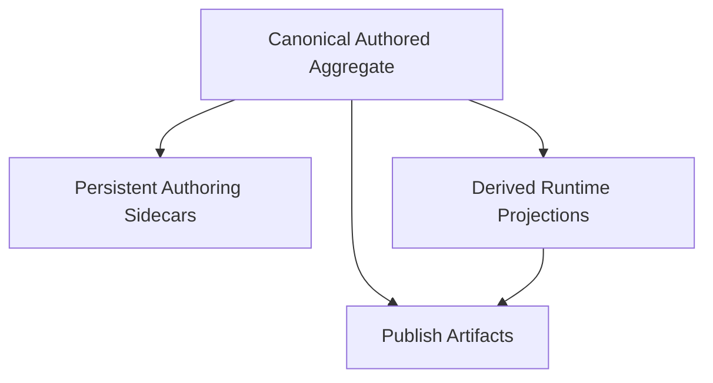

# Proposal 006: Persistence and Serialization Architecture

**Status:** Proposed
**Date:** 2026-03-31

## Summary

Sugarmagic needs a persistence architecture that preserves one canonical authored truth without forcing the runtime to load editor-only baggage.

This proposal defines the high-level persistence and serialization rules for Sugarmagic.

It explains:

- what `single source of truth` means for persistence
- how canonical authored documents differ from serialization views
- how partial serialization should work
- how runtime-facing loads should avoid editor bloat
- how game roots should organize canonical payloads, sidecars, and derived artifacts

This proposal is intentionally:

- high level
- format-aware but not implementation-specific
- independent of final TypeScript interfaces
- independent of final storage engine details

## Relationship to Existing Proposals

This proposal builds directly on:

- [Proposal 002: Sugarmagic Domain Model](/Users/nikki/projects/sugarmagic/docs/proposals/002-sugarmagic-domain-model.md)
- [Proposal 003: Sugarmagic Region Document Model](/Users/nikki/projects/sugarmagic/docs/proposals/003-region-document-model.md)
- [Proposal 004: Sugarmagic ProductMode Shell](/Users/nikki/projects/sugarmagic/docs/proposals/004-productmode-shell.md)
- [Proposal 005: Sugarmagic System Architecture](/Users/nikki/projects/sugarmagic/docs/proposals/005-sugarmagic-system-architecture.md)

It especially refines the serialization boundary introduced in:

- [Proposal 003: Region Document Model](/Users/nikki/projects/sugarmagic/docs/proposals/003-region-document-model.md)
- [Proposal 005: System Architecture](/Users/nikki/projects/sugarmagic/docs/proposals/005-sugarmagic-system-architecture.md)

## Why This Proposal Exists

Unified tools often fail in one of two ways:

1. They split authored truth across editor and runtime models.
2. They keep one giant persistence blob that drags editor-only state into runtime load paths.

Sugarmagic should do neither.

The persistence architecture must satisfy all of these at once:

- one semantic source of truth
- zero duplicated authored meaning
- partial serialization by responsibility
- direct runtime loading of runtime-relevant authored payloads
- clean editor persistence for durable authoring aids
- clean publish derivation for target delivery

## Core Rule

`Single source of truth` means:

- one semantic owner for authored meaning
- one canonical authored aggregate per major domain object
- no competing persisted models that redefine the same authored concept

It does **not** mean:

- one mandatory monolithic file
- one mandatory load path for every caller
- one serialization shape for editor, runtime, and publish

## Persistence Strata

Sugarmagic should organize persistence into four strata.

### 1. Canonical Authored Payloads

These are the persisted payloads that define authored meaning.

Examples:

- game project payload
- region payload
- shared content payloads
- gameplay authored payloads
- plugin configuration payloads

These payloads are the authoritative authored source of truth.

### 2. Persistent Authoring Sidecars

These are persistent editor-assistance payloads.

Examples:

- saved panel expansion state
- author bookmarks
- saved viewport preferences
- authoring annotations that do not change runtime meaning
- optional cached indexes and thumbnails if they are disposable and regenerable

These payloads may improve the authoring experience, but they do not define authored meaning.

### 3. Derived Runtime Projections

These are derived payloads that may exist to accelerate runtime preview, playtest, or target packaging.

Examples:

- packed landscape payloads
- baked geometry payloads
- precomputed scene indices
- runtime-friendly cache payloads

These payloads are derived and disposable.

### 4. Publish Artifacts

These are target-facing deployment outputs.

Examples:

- web bundles
- target manifests
- compatibility exports
- deployment-ready asset packages

These are derived and must never be treated as canonical authored truth.

## Serialization View Model

Each major domain aggregate should support multiple serialization views.



### Interpretation

- the canonical aggregate is primary
- sidecars may exist beside it
- runtime projections may be derived from it
- publish artifacts may be derived from canonical payloads directly or via approved runtime projections

No downstream view is allowed to redefine authored meaning.

## Partial Serialization Rule

Sugarmagic should support partial serialization by responsibility.

That means:

- runtime-facing systems load only runtime-relevant authored payloads
- authoring surfaces may additionally load editor-assistance sidecars
- publish systems may additionally load or derive target projections

### High-level rule in pseudo code

1. Load canonical authored payload.
2. If caller is a runtime path, stop unless a declared derived runtime projection is needed.
3. If caller is an authoring path, optionally hydrate persistent authoring sidecars.
4. If caller is a publish path, derive or load target-specific projections.
5. Never require runtime preview or playtest to hydrate editor-only persistence.

## Zero-Bloat Runtime Rule

The shared runtime should be able to build playable and previewable state from canonical authored payloads without first loading editor-only persistence.

That means the canonical authored payload for a major object like `Region Document` must contain:

- all runtime-relevant authored meaning
- no dependency on inspector UI state
- no dependency on authoring-session convenience state
- no dependency on thumbnail caches or foldout caches

### Practical implication

The runtime should be able to say:

1. load canonical region payload
2. resolve referenced content
3. construct runtime scene state
4. ignore editor sidecars entirely

That is the desired baseline.

## Domain-Specific Persistence Rules

### Game Project

The `Game Project` should persist:

- project identity
- project policies
- references to region/content/gameplay/plugin payloads
- project-scoped configuration

It should not persist:

- transient shell state
- ProductMode selection as canonical authored truth
- play session state

### Content Library

The `Content Library` should persist:

- reusable definitions
- source references
- canonical metadata
- stable identities

It may additionally persist disposable indexes and thumbnails as authoring sidecars or caches.

### Region Document

The `Region Document` should persist canonical authored region meaning in a runtime-consumable payload.

It may additionally persist authoring sidecars for:

- inspector aids
- bookmarks
- author comments or annotations
- local authoring visualization preferences

It may derive runtime projections for:

- packed landscape payloads
- baked geometry payloads
- acceleration structures

### Gameplay Authoring

`Gameplay Authoring` should persist authored graphs, rules, and definitions as canonical payloads.

Editor graph layout metadata may live either:

- inside the canonical authored payload when it is intrinsic to authored graph editing meaning
- or in persistent authoring sidecars when it is purely presentational

The deciding rule is simple:

- if removing it changes authored meaning, it belongs in the canonical payload
- otherwise it belongs in a sidecar

### Plugins

`Plugins` should persist:

- plugin enablement
- plugin config
- plugin-owned authored records where explicitly permitted

Plugin caches, generated indexes, or disposable host state should not be promoted to canonical plugin truth.

## Physical Layout Policy

Sugarmagic should prefer **aggregate folders** for major authored aggregates rather than forcing every aggregate into a single file.

That is the cleanest way to support:

- canonical payloads
- optional sidecars
- disposable projections
- future growth without monolith blobs

### Suggested shape for region persistence

```text
assets/regions/<region-id>/
  region.sgrregion.json            # canonical authored region payload
  authoring/
    region.editor.json             # persistent authoring sidecars
  runtime/
    landscape-pack.bin             # optional derived runtime projection
    geometry-cache.bin             # optional derived runtime projection
  exports/
    geometry.glb                   # compatibility export when requested
    map.json                       # compatibility export when requested
```

### Suggested shape for content definitions

```text
assets/materials/<material-id>/
  material.sgrmat.json             # canonical payload
  authoring/
    material.editor.json           # optional authoring sidecar
```

```text
assets/models/<asset-id>/
  asset.sgrasset.json              # canonical metadata payload
  source/
    source.glb                     # imported source asset
  authoring/
    assembly.json                  # authored assembly payload when needed
```

### Important rule

These examples are architectural shapes, not final filename decisions.

The important design rule is:

- keep canonical payloads easy to identify
- keep editor sidecars clearly separated
- keep derived runtime and export payloads visibly derivative

## Load Paths

Sugarmagic should make the three main load paths explicit.

### Authoring load path

The authoring load path is the richest path.

It may load:

- canonical authored payloads
- persistent authoring sidecars
- optional derived runtime projections if they are valid and useful

Pseudo code:

1. Load canonical authored payloads.
2. Load persistent authoring sidecars where available.
3. Build authoring session state.
4. Reuse shared runtime for preview.
5. Rebuild disposable projections only when stale or missing.

### Runtime preview / playtest load path

The runtime preview path should stay lean.

It should load:

- canonical authored payloads
- referenced shared content
- optional valid runtime projections

It should skip:

- authoring sidecars
- shell layout state
- editor-only view preferences

Pseudo code:

1. Load canonical authored payloads.
2. Resolve shared content.
3. Load or derive declared runtime projections if they improve performance.
4. Build shared runtime state.
5. Do not hydrate authoring sidecars.

### Publish load path

The publish path should load canonical authored payloads and produce target outputs.

Pseudo code:

1. Load canonical authored payloads.
2. Resolve shared content and plugin capabilities.
3. Derive required runtime projections and target artifacts.
4. Write publish outputs and manifests.
5. Verify published target loads correctly.

## Save Rules

### Rule 1: Save authored meaning first

Whenever a canonical authored change occurs, persist the canonical authored payload first.

### Rule 2: Sidecars are optional and replaceable

Persistent authoring sidecars may be written after canonical saves.

If a sidecar is deleted, the canonical authored object must remain valid.

### Rule 3: Derived projections are disposable

Derived runtime projections and exports may be regenerated.

If they cannot be regenerated from canonical authored payloads, the design is wrong.

### Rule 4: ProductMode is not canonical persisted truth

`ProductMode` is a shell concept.

It may be remembered as user preference, but it must not become required authored project truth.

## Versioning and Migrations

Every persisted canonical payload should carry:

- schema identity
- schema version
- stable document identity

Authoring sidecars and derived projections should also carry version markers, but their migration requirements are weaker because they are replaceable.

### Migration rule

Pseudo code:

1. Detect payload kind and version.
2. Migrate canonical authored payloads through declared migration steps.
3. Drop and regenerate disposable sidecars or projections if cheaper than migration.
4. Never let stale sidecars redefine canonical meaning.

## Validation Rules

Validation should happen at the right layer.

### Canonical authored payload validation

Validate:

- required fields
- domain invariants
- stable references
- ownership rules

### Authoring sidecar validation

Validate:

- compatibility with canonical document identity
- schema version
- non-authoritative shape only

If invalid, sidecars may be dropped without corrupting authored meaning.

### Derived runtime/publish validation

Validate:

- projection freshness
- source identity match
- target contract correctness

If invalid, projections should be rebuilt.

## Caching Policy

Sugarmagic should distinguish clearly between:

- persistent sidecars worth keeping
- disposable caches worth rebuilding

A cache should only be persisted if one of these is true:

- rebuild cost is significant
- the cache materially improves authoring responsiveness
- the cache is versionable and easy to invalidate

Otherwise, prefer regeneration.

## Relationship to the Game Root Contract

This proposal preserves the game-root rules established in Sugarengine and carried into Sugarmagic.

- authored content lives in the game root
- authored paths stay root-relative
- derived outputs remain derivative
- compatibility exports belong in explicit derived locations

This aligns with:

- [ADR 025: Multi-Project Game Architecture](/Users/nikki/projects/sugarengine/docs/adr/025-multi-project-architecture.md)
- [ADR 026: Game Root Lifecycle and External Game Discovery](/Users/nikki/projects/sugarengine/docs/adr/026-game-root-lifecycle-and-external-game-discovery.md)
- [ADR 057: Project-Root Asset Import Architecture](/Users/nikki/projects/sugarbuilder/docs/adr/057-project-root-asset-import-architecture.md)
- [ADR 063: Sugarbuilder to Sugarengine Runtime Parity Export Contract](/Users/nikki/projects/sugarbuilder/docs/adr/ADR-063-SUGARENGINE-RUNTIME-PARITY-EXPORT-CONTRACT.md)

## What This Proposal Rules Out

This proposal rules out:

- one giant persistence blob that runtime, authoring, and publish all must hydrate fully
- duplicated authored truth across editor and runtime payloads
- editor-only foldout or shell state being required by runtime preview
- derived exports being treated as canonical project truth
- plugin-owned hidden persistence that bypasses canonical project ownership

## Verifiable Outcomes

This proposal is correct when all of the following are true.

1. The runtime can load a region without loading editor-only sidecars.
2. A deleted authoring sidecar does not corrupt authored meaning.
3. A deleted derived runtime projection can be regenerated from canonical payloads.
4. A deleted publish artifact can be regenerated from canonical payloads.
5. Authoring surfaces can keep durable convenience state without bloating the runtime path.
6. For every persisted file, the team can say whether it is canonical, sidecar, derived runtime, or publish output.

## Follow-On Work

This proposal should be followed by:

1. a canonical file naming and folder contract proposal
2. a schema/versioning proposal
3. a migration proposal from Sugarbuilder and Sugarengine persistence into Sugarmagic
