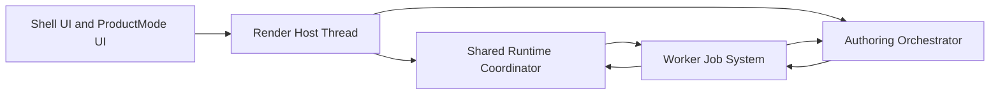
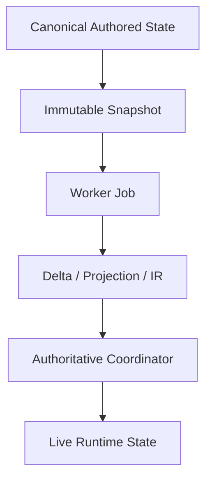

# Proposal 007: Execution and Concurrency Architecture

**Status:** Proposed
**Date:** 2026-03-31

## Summary

Sugarmagic needs an execution model that preserves `single enforcer` semantics without turning the browser main thread into a bottleneck.

This proposal defines the high-level concurrency architecture for Sugarmagic.

It explains:

- what `single enforcer` means in an execution model
- which responsibilities stay on the render host thread
- which responsibilities must be worker-friendly from the start
- how live authoring stays responsive while sharing one runtime
- how runtime preview and heavy authoring operations avoid starving each other

This proposal is intentionally:

- high level
- architecture-focused
- independent of the final worker library or scheduler implementation
- independent of final TypeScript types

## Relationship to Existing Proposals

This proposal builds directly on:

- [Proposal 002: Sugarmagic Domain Model](/Users/nikki/projects/sugarmagic/docs/proposals/002-sugarmagic-domain-model.md)
- [Proposal 003: Sugarmagic Region Document Model](/Users/nikki/projects/sugarmagic/docs/proposals/003-region-document-model.md)
- [Proposal 005: Sugarmagic System Architecture](/Users/nikki/projects/sugarmagic/docs/proposals/005-sugarmagic-system-architecture.md)
- [Proposal 006: Persistence and Serialization Architecture](/Users/nikki/projects/sugarmagic/docs/proposals/006-persistence-and-serialization.md)

It especially refines the runtime and authoring relationship described in:

- [ADR 056: Layout Interaction Architecture](/Users/nikki/projects/sugarbuilder/docs/adr/056-layout-interaction-architecture.md)
- [ADR 063: Sugarbuilder to Sugarengine Runtime Parity Export Contract](/Users/nikki/projects/sugarbuilder/docs/adr/ADR-063-SUGARENGINE-RUNTIME-PARITY-EXPORT-CONTRACT.md)
- [ADR 013: VFX System](/Users/nikki/projects/sugarengine/docs/adr/013-vfx-system.md)

## Why This Proposal Exists

On the web, one bad assumption can poison the whole architecture:

- if `single enforcer` is interpreted as `single main-thread implementation`, the product will hitch under heavy authoring work
- if concurrency is handled ad hoc, the product will drift into multiple competing implementations again

Sugarmagic needs a model where:

- authored semantics stay singular
- execution can be distributed
- the render host stays responsive
- heavy work can be canceled, coalesced, and resumed cleanly

## Core Rule

`Single enforcer` means:

- one authoritative implementation of a behavior
- one authoritative contract for inputs and outputs
- one authoritative mutation path for canonical truth

It does **not** mean:

- one thread
- one process
- one blocking code path

A single enforcer may be implemented as:

- a main-thread coordinator plus worker executors
- a runtime facade plus worker-backed job pipeline
- a canonical domain service plus background derivation workers

What is prohibited is duplicated behavior.

What is allowed is distributed execution behind one contract.

## Execution Model Overview

Sugarmagic should use a **thin render host + worker-backed heavy jobs** model.



### Interpretation

- the render host owns the live viewport, GPU-facing objects, and user interaction loop
- heavy pure or mostly-pure computation is pushed to workers
- workers do not become alternate domain owners
- worker results return through the same authoritative coordinators

## Main Thread Rule

The main thread should stay responsible for:

- shell UI
- pointer and keyboard input
- immediate interaction feedback
- viewport composition
- GPU-facing runtime object creation and updates
- final authoritative application of accepted results to live runtime state

The main thread should **not** perform long-running CPU work if that work can be isolated and moved.

## Worker Rule

Workers should own heavy computation that is:

- deterministic
- side-effect-light or side-effect-free
- snapshot-driven
- serializable across thread boundaries
- cancelable or replaceable

Examples include:

- landscape brush rasterization
- splat packing and unpacking
- material graph analysis and intermediate compilation stages
- import indexing and metadata extraction
- geometry baking and mesh projection preprocessing
- publish derivation work
- search indexing
- graph layout and heavy validation passes

## WASM Rule

Sugarmagic should be **WASM-ready**, but not WASM-first by dogma.

The rule should be:

- design hot-path worker jobs behind stable contracts from the start
- move specific kernels to WASM only when profiling justifies it

Likely future WASM candidates include:

- mesh processing
- geometry baking
- splat packing kernels
- compression and transcoding
- heavy graph or spatial indexing kernels

The important architecture point is that WASM should sit behind the same worker job contract, not create a second semantic path.

## Render Host Versus Job System

Sugarmagic should separate the runtime into two execution roles.

### 1. Render Host

The render host owns live, frame-sensitive state.

It is responsible for:

- running the frame loop
- accepting user input
- keeping the viewport interactive
- applying accepted deltas to GPU/runtime objects
- presenting preview overlays immediately when possible

### 2. Job System

The job system owns heavy background computation.

It is responsible for:

- receiving immutable snapshots or compact commands
- running heavy transformations off the render host
- producing deterministic deltas, projections, or derived payloads
- returning results tagged with generation/version metadata

## Concurrency Strategy by Subsystem

### Material Compiler

The `Material Compiler` should be split conceptually into:

- a canonical material semantics enforcer
- background analyzers and preprocessors
- render-host finalization

#### Rule

The heavy CPU stages should be worker-friendly.

The GPU-facing material object finalization should stay on the render host.

#### High-level pipeline

1. Snapshot the canonical material graph.
2. Send analysis and normalization work to a worker.
3. Return an intermediate compiled description.
4. Finalize the runtime material object on the render host.
5. Swap the live material only if the result still matches the latest generation.

### Landscape Renderer and Brush System

The `Landscape` system should split into:

- canonical landscape state
- immediate lightweight brush feedback on the render host
- worker-backed splat mutation and packing
- render-host application of the accepted landscape delta

#### High-level pipeline

1. Start brush session on the render host.
2. Show immediate preview overlay or preview mask.
3. Coalesce stroke samples into background jobs.
4. Rasterize the canonical landscape delta in a worker.
5. Return updated splat or patch deltas.
6. Apply the latest accepted delta on the render host.
7. Drop stale results automatically.

This preserves responsiveness without creating a second landscape semantics path.

### Geometry and Import Work

Import, indexing, geometry derivation, and compatibility export should be worker-first by default.

These are not frame-critical.

They should not compete with the live viewport for main-thread time.

### Publish Work

Publish derivation should be background-first by default.

If publishing blocks the viewport, the architecture is wrong.

### VFX

VFX simulation must be split carefully.

- frame-sensitive live simulation remains on the render host or runtime-critical path
- authoring-time generation, cache building, and non-frame-critical preprocessing should be worker-friendly

## Snapshot and Delta Model

Sugarmagic should use a **snapshot-in, delta-out** rule for heavy jobs.



### Why this matters

This avoids:

- workers mutating live runtime state directly
- race-prone shared mutable state
- hidden ownership drift

It also makes cancellation and stale-result rejection much easier.

## Generation and Cancellation Rule

Every background job should be tagged with:

- source document identity
- source generation or revision
- job kind
- job purpose

When results return:

1. compare the result generation to the current canonical generation
2. if stale, drop it
3. if current, apply it through the authoritative coordinator

This should be the default policy.

### Consequence

Sugarmagic should prefer `latest wins` semantics for interactive derivation work such as:

- brush strokes
- drag previews
- graph edits
- slider-driven environment changes

## Quality Tiering During Interaction

Heavy live interactions should support two phases.

### Phase 1: Interactive preview

During active input:

- favor low-latency approximations
- preserve responsiveness
- avoid blocking final-quality recompute on every event

### Phase 2: Commit refinement

After input settles:

- schedule final-quality recomputation
- replace provisional results with canonical-quality results
- persist canonical authored meaning

This follows the same spirit as Sugarbuilder's preview-versus-commit interaction rules from [ADR 056](/Users/nikki/projects/sugarbuilder/docs/adr/056-layout-interaction-architecture.md).

## Worker-Friendly Design Rules

A subsystem is worker-friendly when:

- inputs are explicit
- outputs are explicit
- heavy computation is deterministic
- dependencies on DOM or live GPU objects are isolated
- the subsystem can run on immutable snapshots

A subsystem is **not** worker-friendly when:

- it closes over live editor UI state
- it mutates live runtime objects mid-computation
- it depends on hidden singletons
- it mixes domain mutation with rendering side effects

Sugarmagic should design enforcers to be worker-friendly whenever the workload is heavy enough to threaten frame time.

## Transfer and Memory Rule

When moving heavy payloads across workers, Sugarmagic should prefer:

- transferables for large binary payloads
- compact snapshots over giant object graphs
- patch/delta transfer over full-state transfer when practical

This aligns with the web platform's worker and transferable guidance.

## Relationship to the Shared Runtime

This concurrency model preserves one runtime.

It does not split Sugarmagic back into:

- editor runtime versus game runtime
- worker runtime versus main-thread runtime
- fast preview semantics versus real runtime semantics

Instead, it says:

- one runtime semantics layer
- one authoritative coordinator per behavior
- multiple execution locations where useful

That is the right interpretation of `single enforcer` on the web.

## Relationship to the Persistence Model

This proposal also complements [Proposal 006: Persistence and Serialization Architecture](/Users/nikki/projects/sugarmagic/docs/proposals/006-persistence-and-serialization.md).

The worker system should primarily consume:

- canonical authored payloads
- immutable snapshots derived from canonical payloads
- derived projections when explicitly allowed

It should not depend on:

- editor-only sidecars
- shell state
- panel layout state
- view-only caches unless they are declared job inputs

## Proposed File / Folder Influence

This proposal does not force the entire file layout, but it does imply a stable concurrency home in the repo.

Suggested additions inside the architecture from [Proposal 005](/Users/nikki/projects/sugarmagic/docs/proposals/005-sugarmagic-system-architecture.md):

```text
/packages/runtime-core/
  /jobs/
  /coordination/
  /materials/
  /landscape/
  /scene/

/targets/web/
  /workers/
  /transfer/
  /scheduling/
```

### Meaning

- `/coordination/` owns authoritative host-side coordinators
- `/jobs/` defines job contracts and job kinds
- `/workers/` owns web worker hosts and adapters
- `/transfer/` owns snapshot and delta transfer helpers
- `/scheduling/` owns priority, cancellation, and coalescing rules

## High-Level Algorithms

### Algorithm: Run Heavy Interactive Job

1. Accept canonical change intent on the render host.
2. Produce immediate lightweight preview if possible.
3. Snapshot the relevant canonical state.
4. Submit background job with generation tag.
5. Continue rendering without waiting.
6. When the result returns, compare generation.
7. If current, apply through the authoritative coordinator.
8. If stale, discard.

### Algorithm: Compile Material After Graph Edit

1. Accept material graph mutation.
2. Persist canonical graph change.
3. Schedule background graph analysis and normalization.
4. Produce intermediate compiled description.
5. Finalize GPU-facing material on the render host.
6. Swap into live runtime if the result is still current.

### Algorithm: Apply Landscape Brush Stroke

1. Begin stroke session.
2. Show immediate brush preview.
3. Batch stroke samples for a short interval.
4. Send rasterization job to worker.
5. Receive landscape delta tagged with the current stroke generation.
6. Apply delta if current.
7. Trigger final refinement after stroke end.

## What This Proposal Rules Out

This proposal rules out:

- treating the main thread as the default home for all single enforcers
- duplicating behavior so workers and runtime preview disagree semantically
- letting workers mutate live runtime objects directly
- using editor UI state as implicit worker input
- blocking publish, import, or heavy derivation work on the frame loop

## Verifiable Outcomes

This proposal is correct when all of the following are true.

1. Heavy authoring interactions do not freeze the live viewport by default.
2. The runtime preview remains interactive during background derivation work.
3. Material and landscape semantics remain singular even when work is distributed.
4. Stale worker results can be dropped safely.
5. Publish and import work do not require the live frame loop to stall.
6. Worker or WASM adoption can happen without creating a second semantic implementation.

## Research and Prior Art

This proposal draws from:

- [ADR 056: Layout Interaction Architecture](/Users/nikki/projects/sugarbuilder/docs/adr/056-layout-interaction-architecture.md)
- [ADR 063: Sugarbuilder to Sugarengine Runtime Parity Export Contract](/Users/nikki/projects/sugarbuilder/docs/adr/ADR-063-SUGARENGINE-RUNTIME-PARITY-EXPORT-CONTRACT.md)
- [ADR 013: VFX System](/Users/nikki/projects/sugarengine/docs/adr/013-vfx-system.md)
- [Using Web Workers - MDN](https://developer.mozilla.org/docs/Web/API/Web_Workers_API/Using_web_workers)
- [Transferable objects - MDN](https://developer.mozilla.org/en-US/docs/Web/API/Web_Workers_API/Transferable_objects)
- [OffscreenCanvas - MDN](https://developer.mozilla.org/en-US/docs/Web/API/OffscreenCanvas/getContext)

### How those references affect this proposal

- MDN's worker guidance reinforces the choice to move deterministic heavy jobs off the main thread.
- MDN's transferable guidance reinforces the need for binary-friendly snapshot and delta passing instead of giant object cloning.
- OffscreenCanvas guidance supports a design where some off-main-thread rendering or raster work may be adopted behind stable contracts when justified.

## Follow-On Work

This proposal should be followed by:

1. a scheduling and job priority proposal
2. a runtime coordination contract proposal
3. a worker snapshot/delta contract proposal
4. a profiling and frame-budget policy proposal
