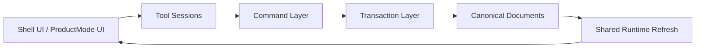
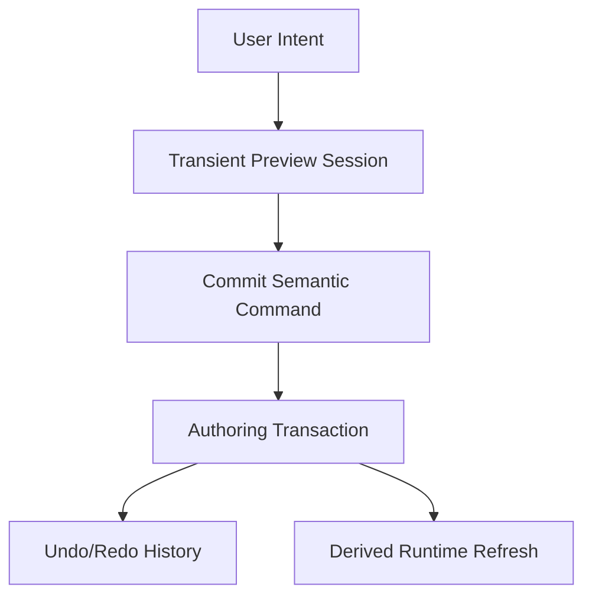

# Proposal 008: Command and Transaction Architecture

**Status:** Proposed
**Date:** 2026-03-31

## Summary

Sugarmagic needs a formal command and transaction architecture between UI intent and canonical document mutation.

This proposal defines that layer.

It explains:

- how Sugarmagic should interpret `undoable authoring action` versus `runtime state change`
- how authoring intent reaches canonical documents safely
- how live interactions avoid corrupting canonical truth with half-finished UI state
- how undo and redo should work across ProductModes without blurring authored state and play state

This proposal is intentionally:

- high level
- architecture-first
- independent of detailed store layout
- independent of final TypeScript interfaces

## Relationship to Existing Proposals

This proposal builds directly on:

- [Proposal 002: Sugarmagic Domain Model](/Users/nikki/projects/sugarmagic/docs/proposals/002-sugarmagic-domain-model.md)
- [Proposal 003: Sugarmagic Region Document Model](/Users/nikki/projects/sugarmagic/docs/proposals/003-region-document-model.md)
- [Proposal 004: Sugarmagic ProductMode Shell](/Users/nikki/projects/sugarmagic/docs/proposals/004-productmode-shell.md)
- [Proposal 005: Sugarmagic System Architecture](/Users/nikki/projects/sugarmagic/docs/proposals/005-sugarmagic-system-architecture.md)
- [Proposal 006: Persistence and Serialization Architecture](/Users/nikki/projects/sugarmagic/docs/proposals/006-persistence-and-serialization.md)
- [Proposal 007: Execution and Concurrency Architecture](/Users/nikki/projects/sugarmagic/docs/proposals/007-execution-and-concurrency-architecture.md)

It especially refines:

- [ADR 056: Layout Interaction Architecture](/Users/nikki/projects/sugarbuilder/docs/adr/056-layout-interaction-architecture.md)
- [ADR 018: Structured World State System](/Users/nikki/projects/sugarengine/docs/adr/018-world-state-system.md)

## Why This Proposal Exists

A unified product cannot survive on ad hoc mutation rules.

Without a formal command/transaction layer, Sugarmagic will drift toward:

- UI code mutating canonical documents directly
- half-finished drag, brush, and graph interactions leaking into authored truth
- undo/redo working in some ProductModes but not others
- authoring changes and play-state changes becoming indistinguishable

That would violate:

- one source of truth
- single enforcer
- goals must be verifiable

So this layer needs to be explicit from the start.

## Relationship to Store Management

Sugarmagic may use `zustand` for shell-facing and authoring-session-facing state such as:

- active `ProductMode`
- selection
- tool session coordination
- panel and shell state

That is compatible with this proposal.

What is not compatible is allowing store mutation to become the canonical authored mutation path.

### Rule

Stores may coordinate intent and preview state.

Stores must not:

- become the canonical owner of authored truth
- replace semantic commands
- replace transactions
- bypass undo/redo boundaries

### Placement guideline

Use local component state for local UI drafts and presentation details.

Use `zustand` for shared shell coordination such as selection, active tool sessions, and panel state.

Use commands and transactions when the state change is authored meaning.

Use runtime session state when the state change comes from simulation.

### Lifetime guideline

Transient preview and tool-session state should have an explicit lifetime and disposal rule.

That means:

- tool-session preview state ends when the interaction commits or cancels
- ProductMode changes must not silently carry unresolved transient tool state forward
- runtime-session state ends when the runtime session ends unless explicitly promoted through an authored command

## Core Rule

Every canonical authored mutation must pass through a formal command and transaction boundary.

That means:

- UI does not directly mutate canonical documents
- UI stores do not directly mutate canonical documents
- tools do not directly mutate canonical documents
- runtime preview systems do not directly mutate canonical documents
- plugins do not directly mutate canonical documents except through the same command boundary

The only permitted path is:

1. intent
2. command
3. validation
4. transaction
5. canonical mutation
6. derived updates

## Two Kinds of Change

Sugarmagic must distinguish two fundamentally different kinds of change.

### 1. Authoring Change

An `Authoring Change` modifies canonical authored truth.

Examples:

- move a placed NPC definition in a region
- paint the landscape
- assign a material
- edit atmosphere
- create a quest node
- update a plugin configuration value

These changes are:

- undoable
- redoable
- persistable
- part of authored history

### 2. Runtime State Change

A `Runtime State Change` modifies live play or preview state.

Examples:

- an NPC walking during playtest
- a quest flag flipping during simulation
- player health changing in play mode
- temporary preview overlays during a drag

These changes are:

- not automatically part of authored undo/redo
- not canonical authored truth
- typically resettable or isolated to a runtime session

## Boundary Rule

Undo/redo applies to `Authoring Change`, not to general `Runtime State Change`.

If a user is in a ProductMode and moves an NPC as an authored placement change, that is an authoring command.

If an NPC moves because the simulation is running, that is runtime session state.

The same visible object may participate in both worlds, but the change kinds remain different.
## Playtest Boundary Rule

Switching from authoring into playtest should create a new isolated `Runtime Session` from committed authored state.

It should not rely on mutating the live authored scene and then attempting a giant hot reset afterward.

### Rule

- resolve any active transient authoring session first
- snapshot the workspace context
- start playtest from committed authored state
- keep runtime mutations inside `Runtime Session`
- on stop, discard the runtime session and restore the workspace context

### Undo implication

Authoring undo history continues to target committed authored transactions.

Playtest state changes do not enter that history by default.

### Future extension

A future explicit feature may allow `apply from playtest` style workflows, but that must be an explicit authored command, not an automatic side effect of stopping playtest.


## System Model

Sugarmagic should introduce a dedicated command and transaction layer inside the Authoring Orchestration System.



### Interpretation

- tools interpret interaction
- commands express authoring intent
- transactions apply validated canonical mutations
- runtime refresh is derived afterward

That preserves one mutation boundary.

## Command Layer

The `Command Layer` should be the formal representation of authoring intent.

A command should describe:

- what the user intends to change
- which canonical aggregate it targets
- what preconditions must hold
- how the mutation should be validated
- what undo information is required

### Examples

- `MovePlacedAssetCommand`
- `PaintLandscapeCommand`
- `AssignMaterialToSlotCommand`
- `UpdateEnvironmentCommand`
- `CreateQuestNodeCommand`
- `MoveGameplayPlacementCommand`

### Important rule

Commands should be semantic.

Avoid commands like:

- `SetFieldXToValueY`
- `PatchArbitraryJson`

Those are too weak to preserve domain clarity.

## Transaction Layer

The `Transaction Layer` should own atomic canonical mutation.

A transaction should:

- validate preconditions
- apply one or more related canonical mutations atomically
- emit a stable before/after boundary for undo and redo
- notify downstream projections and runtime systems

### Why transactions matter

Some user actions mutate more than one document or subdomain at once.

Examples:

- deleting an asset placement may also affect selection and references
- changing a material slot may affect region material bindings and derived runtime projections
- importing an asset may create canonical metadata plus references plus derived indexing updates

Those should be one transaction, not a pile of unrelated field writes.

## Interaction Sessions Versus Commands

Sugarmagic should keep the distinction from Sugarbuilder's interaction architecture.

### Interaction session

An interaction session is live, transient, and not yet canonical.

Examples:

- dragging an object
- rotating with a gizmo
- brushing continuously over the landscape
- manipulating a graph node before release

### Command commit

A command commit is the moment the canonical authored mutation is accepted.

### Rule

Preview is not commit.

In short English pseudo code:

1. Start interaction session.
2. Show transient preview.
3. Update preview while input is live.
4. On accept, emit semantic command.
5. Run transaction.
6. Push undoable history record.

This means transient preview state may live in component state, tool-session state, or shell/application stores, but canonical authored truth does not change until command commit.

The same rule helps prevent camera and mode bleed:

- transient framing and tool-specific camera assists may exist during a session
- they must not overwrite the durable authoring camera context unless an explicit command or shell rule says they should

This should be the default interaction model across ProductModes.

## Undo/Redo Model

Sugarmagic should implement undo and redo as history over committed authoring transactions.



### Rules

1. Only committed authoring transactions enter undo history.
2. Runtime session changes do not enter authoring undo history by default.
3. Undo restores canonical authored state, then refreshes derived runtime state.
4. Redo reapplies canonical authored state, then refreshes derived runtime state.

## History Scope

Sugarmagic should support multiple history scopes, but only one should be active for canonical authored undo at a time.

### Recommended scopes

- `Project Authoring History`
- `Runtime Session History` as a separate optional concept later
- local transient tool session history where needed

### Immediate recommendation

Start with:

- one authoritative `Project Authoring History`

Do **not** attempt to merge play-session rewinds into the same history stack.

That is how semantics get muddy.

## ProductMode Implications

All ProductModes should use the same command and transaction architecture.

### `Design`

Commands mutate:

- gameplay authored documents
- content definitions
- plugin configuration where relevant

### `Build`

Commands mutate:

- region documents
- asset placements
- landscape
- environment
- region-local gameplay placements

### `Render`

Commands mutate:

- presentation-facing authored definitions
- VFX authored definitions
- compositing and presentation documents where those become canonical authored domains

Important rule:

`ProductMode` changes what kinds of commands are available.

It does not change the existence of the command boundary.

## Plugin Rule

Plugins may contribute commands, but they must do so through the same transaction architecture.

That means:

- plugin commands are declared capabilities
- plugin transactions validate against canonical ownership rules
- plugin changes enter the same authoritative authoring history when they mutate canonical truth

Plugins must not invent hidden side mutation paths.

## Concurrency Rule

This proposal must work with [Proposal 007: Execution and Concurrency Architecture](/Users/nikki/projects/sugarmagic/docs/proposals/007-execution-and-concurrency-architecture.md).

So the rule is:

- commands and transactions remain authoritative
- heavy preview or derivation work may be distributed to workers
- worker results do not bypass the command boundary

In short English pseudo code:

1. Interaction session produces preview work.
2. Background jobs may compute preview or derivation results.
3. Canonical authored mutation still requires command commit and transaction apply.
4. Undo/redo still targets canonical transactions only.

## Persistence Rule

This proposal must also align with [Proposal 006: Persistence and Serialization Architecture](/Users/nikki/projects/sugarmagic/docs/proposals/006-persistence-and-serialization.md).

So:

- command commit mutates canonical authored payloads
- sidecars may persist authoring aids separately
- derived runtime projections may update afterward
- publish artifacts remain downstream and derived

## Validation Rule

Command validation should happen before canonical mutation.

Transaction validation should happen at commit time.

### High-level validation flow

1. Validate command shape and references.
2. Validate domain preconditions.
3. Open transaction.
4. Apply atomic mutation.
5. Record undo/redo data.
6. Notify runtime and projection systems.

## Suggested Architectural Home

This proposal implies explicit architecture inside the structure from [Proposal 005](/Users/nikki/projects/sugarmagic/docs/proposals/005-sugarmagic-system-architecture.md).

Suggested additions:

```text
/packages/domain/
  /commands/
  /transactions/
  /history/

/packages/runtime-core/
  /projection-refresh/

/packages/productmodes/
  /design/commands/
  /build/commands/
  /render/commands/
```

### Meaning

- `/commands/` defines semantic authoring intents
- `/transactions/` defines atomic mutation boundaries
- `/history/` defines undo/redo mechanics over committed authoring transactions
- `ProductMode` folders may contribute command registrations, but they do not own the command architecture itself

## High-Level Algorithms

### Algorithm: Commit Authoring Action

1. Interpret user intent through a tool session.
2. Create a semantic command.
3. Validate the command.
4. Open an authoring transaction.
5. Apply canonical mutation atomically.
6. Record undo and redo information.
7. Notify derived runtime refresh.
8. Persist canonical payloads.

### Algorithm: Undo

1. Pop the last committed authoring transaction.
2. Apply its inverse through the same authoritative mutation boundary.
3. Refresh derived runtime state.
4. Persist canonical payloads if needed.
5. Push the transaction onto redo history.

### Algorithm: Drag Then Commit

1. Start drag interaction session.
2. Update transient preview while dragging.
3. Do not mutate canonical documents yet.
4. On release, create a semantic move command.
5. Commit through one authoring transaction.
6. Add one undoable history entry.

### Algorithm: Brush Stroke

1. Start brush session.
2. Show transient preview and coalesced deltas.
3. Keep canonical truth unchanged while the stroke is live.
4. On stroke commit, create a semantic paint command.
5. Commit one or more bounded authoring transactions according to the chosen stroke policy.
6. Record undoable history.

## What This Proposal Rules Out

This proposal rules out:

- direct canonical mutation from view code
- direct canonical mutation from UI stores
- direct canonical mutation from tool controllers
- direct canonical mutation from runtime preview code
- merging play-session state changes into authoring undo by default
- field-patch style commands that erase domain meaning
- half-finished interaction state leaking into canonical documents

## Verifiable Outcomes

This proposal is correct when all of the following are true.

1. Every canonical authored mutation can be traced to a semantic command.
2. Undo and redo operate over committed authoring transactions, not UI event fragments.
3. Dragging or brushing does not corrupt canonical documents before commit.
4. Runtime session changes do not silently pollute authored undo history.
5. Plugins cannot bypass the command boundary when mutating authored truth.
6. The same command/transaction model works across `Design`, `Build`, and `Render` ProductModes.

## Research and Prior Art

This proposal draws primarily from:

- [ADR 056: Layout Interaction Architecture](/Users/nikki/projects/sugarbuilder/docs/adr/056-layout-interaction-architecture.md)
- [ADR 018: Structured World State System](/Users/nikki/projects/sugarengine/docs/adr/018-world-state-system.md)
- [Proposal 005: Sugarmagic System Architecture](/Users/nikki/projects/sugarmagic/docs/proposals/005-sugarmagic-system-architecture.md)
- [Proposal 006: Persistence and Serialization Architecture](/Users/nikki/projects/sugarmagic/docs/proposals/006-persistence-and-serialization.md)
- [Proposal 007: Execution and Concurrency Architecture](/Users/nikki/projects/sugarmagic/docs/proposals/007-execution-and-concurrency-architecture.md)

### How those references affect this proposal

- ADR 056 reinforces the preview-versus-commit distinction and centralized selection/tool ownership.
- ADR 018 reinforces the need to distinguish authored truth from live world state.
- The Sugarmagic architecture proposals require one canonical mutation boundary that survives ProductMode changes and worker-based execution.

## Follow-On Work

This proposal should be followed by:

1. a detailed history policy proposal
2. a command naming and taxonomy proposal
3. a transaction rollback and conflict policy proposal
4. a plugin command capability contract proposal
