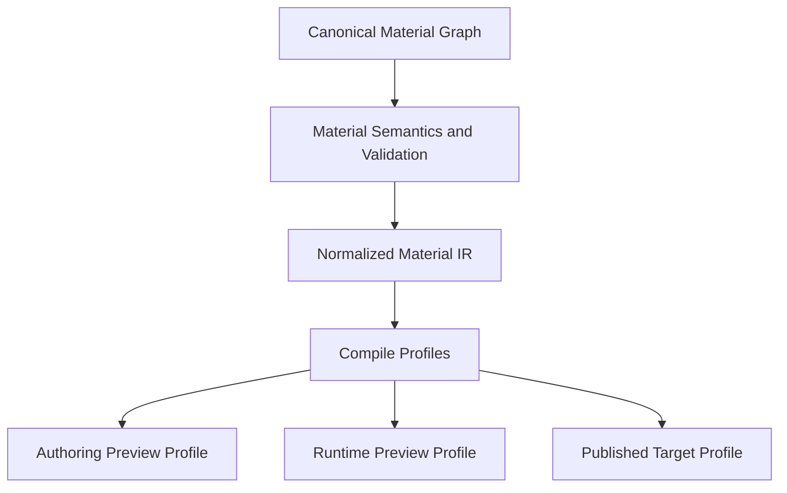

# Proposal 009: Material Compilation and Shader Pipeline Architecture

**Status:** Proposed
**Date:** 2026-03-31

## Summary

Sugarmagic needs one material semantics system, but it should not use one undifferentiated shader compilation mode for every context.

This proposal defines the high-level material compilation architecture for Sugarmagic.

It explains:

- what `one material compiler` should mean
- how authoring preview, runtime preview, and published targets should share semantics without sharing every compile mode
- how ahead-of-time and just-in-time compilation should coexist
- how debug and inspection shaders stay out of production pipelines
- how GPU memory and shader churn should stay under control on the web

This proposal is intentionally:

- high level
- architecture-first
- independent of final TypeScript interfaces
- independent of exact Three.js wrapper code

## Relationship to Existing Proposals

This proposal builds directly on:

- [Proposal 005: Sugarmagic System Architecture](/Users/nikki/projects/sugarmagic/docs/proposals/005-sugarmagic-system-architecture.md)
- [Proposal 006: Persistence and Serialization Architecture](/Users/nikki/projects/sugarmagic/docs/proposals/006-persistence-and-serialization.md)
- [Proposal 007: Execution and Concurrency Architecture](/Users/nikki/projects/sugarmagic/docs/proposals/007-execution-and-concurrency-architecture.md)
- [Proposal 008: Command and Transaction Architecture](/Users/nikki/projects/sugarmagic/docs/proposals/008-command-and-transaction-architecture.md)

It also carries forward key lessons from:

- [ADR 040: Material System](/Users/nikki/projects/sugarbuilder/docs/adr/ADR-040-MATERIAL-SYSTEM.md)
- [ADR 058: Height Parallax Material Architecture](/Users/nikki/projects/sugarbuilder/docs/adr/ADR-058-HEIGHT-PARALLAX-MATERIAL-ARCHITECTURE.md)
- [ADR 061: Projection-Based Surface Mapping](/Users/nikki/projects/sugarbuilder/docs/adr/ADR-061-PROJECTION-BASED-SURFACE-MAPPING.md)
- [ADR 062: Slot-Driven Asset Material Authoring](/Users/nikki/projects/sugarbuilder/docs/adr/ADR-062-SLOT-DRIVEN-ASSET-MATERIAL-AUTHORING.md)
- [ADR 063: Sugarbuilder to Sugarengine Runtime Parity Export Contract](/Users/nikki/projects/sugarbuilder/docs/adr/ADR-063-SUGARENGINE-RUNTIME-PARITY-EXPORT-CONTRACT.md)

## Why This Proposal Exists

On the web, shader work creates a specific class of pain:

- compilation hitching
- shader permutation explosion
- GPU memory bloat
- editor-only debug variants leaking into runtime builds
- runtime and authoring drifting apart semantically because they use different compilation logic

Sugarmagic should avoid both bad extremes:

1. one shared implementation that compiles every context the same way and drags debug variants into production
2. separate editor and runtime compilers that drift semantically over time

## Core Rule

`One material compiler` should mean:

- one authoritative material semantics layer
- one authoritative graph normalization and validation layer
- one authoritative runtime-visible meaning for nodes, mappings, and outputs

It should **not** mean:

- one compile profile for every context
- one shader variant policy for every context
- one cache namespace for every context

## Compiler Model

Sugarmagic should separate material compilation into three conceptual layers.



### Interpretation

- canonical material graphs remain the authored source of truth
- semantics and validation remain singular
- normalization to a stable intermediate representation remains singular
- compile profiles differ by execution context and delivery need

This preserves one enforcer for meaning without forcing one output shape.

## Semantic Compiler Versus Compile Profiles

### Semantic compiler

The semantic compiler owns:

- graph validation
- node meaning
- coordinate and mapping meaning
- projection semantics
- output semantics
- graph normalization
- stable intermediate representation generation

This layer must be shared.

### Compile profiles

Compile profiles own:

- debug visibility features
- inspection hooks
- optimization level
- target-specific specialization
- cache policy
- warmup or precompile policy

These profiles may differ.

## Required Compile Profiles

Sugarmagic should start with three material compile profiles.

### 1. Authoring Preview Profile

Purpose:

- support active authoring and inspection
- allow selected debug and introspection aids
- optimize for edit responsiveness and explainability

May include:

- debug channels
- inspection overlays
- authoring-only diagnostics
- lower-cost provisional compile behavior during interaction

Must not become canonical material meaning.

### 2. Runtime Preview Profile

Purpose:

- drive the in-app live runtime preview and playtest
- stay as close as possible to shipped runtime behavior
- avoid editor-only debug baggage

This should be the default visual truth profile for authored content.

### 3. Published Target Profile

Purpose:

- produce the production runtime material pipeline for delivery targets
- exclude editor-only diagnostics
- support ahead-of-time warming, specialization, and packaging where useful

This profile should be production-safe and delivery-oriented.

## JIT and AOT Policy

Sugarmagic should use a hybrid policy.

### Authoring and local preview

Use primarily **JIT-oriented compilation** with caching and profile-aware reuse.

Reason:

- authoring graphs change frequently
- iteration speed matters
- many variants are exploratory and short-lived

### Publish and target preparation

Use **AOT-oriented derivation and warmup** where the target benefits from it.

Reason:

- publish is the right place to pay one-time preparation cost
- targets benefit from fewer first-frame surprises
- target-specific material specialization belongs with target derivation, not with everyday authoring mutation

### Rule

Sugarmagic should not choose `AOT everywhere` or `JIT everywhere` as dogma.

The right rule is:

- semantic compilation remains singular
- authoring preview stays JIT-friendly
- published targets may derive AOT-friendly artifacts, caches, or warmup manifests

## Debug Shader Containment Rule

Editor-only debug and inspection shader behavior must be profile-scoped and non-canonical.

That means:

- debug shader variants are not persisted as canonical material truth
- debug shader variants are not emitted into published target artifacts by default
- debug instrumentation must be gated by the compile profile
- runtime preview should not silently pick up authoring-only debug variants

### In short English pseudo code

1. Read canonical material graph.
2. Normalize to canonical IR.
3. Select compile profile.
4. Add only the capabilities allowed by that profile.
5. Compile and cache within that profile namespace.
6. Never let a debug-only variant cross into the production profile by accident.

## Cache Namespace Rule

Sugarmagic should keep material caches profile-aware.

A material cache key should include at least:

- canonical material identity
- canonical material revision
- compile profile identity
- target capability tier where relevant

This prevents:

- authoring debug variants being reused by runtime preview
- runtime preview variants being confused with published target variants
- stale variants surviving across material graph edits

## GPU Memory Rule

The material system should treat GPU memory as a constrained runtime resource.

That means:

- unused variants should be releasable
- debug variants should be short-lived
- caches should be bounded by profile and recency
- long-lived production variants should not share the same retention policy as exploratory editor variants

### Rule of thumb

Authoring preview caches optimize for responsiveness.

Published target caches optimize for stable production behavior.

These are not the same retention problem.

## Runtime Preview Trust Rule

The in-app live runtime preview should use the `Runtime Preview Profile`, not the `Authoring Preview Profile`, as the default visual truth path.

This is important.

It means:

- inspection tools may temporarily show alternate debug views when explicitly requested
- but the ordinary viewport should render through the runtime-truth profile

That preserves visual trust.

## Interaction with Concurrency

This proposal depends on [Proposal 007: Execution and Concurrency Architecture](/Users/nikki/projects/sugarmagic/docs/proposals/007-execution-and-concurrency-architecture.md).

The intended split is:

- semantic validation and normalization can be worker-friendly
- compile-plan generation can be worker-friendly
- GPU-facing material object finalization remains on the render host

### High-level pipeline

1. Snapshot canonical material graph.
2. Run validation and normalization.
3. Produce intermediate representation.
4. Select compile profile.
5. Generate profile-specific compile plan.
6. Finalize GPU-facing objects on the render host.
7. Swap into live runtime if still current.

## Relationship to Persistence

This proposal depends on [Proposal 006: Persistence and Serialization Architecture](/Users/nikki/projects/sugarmagic/docs/proposals/006-persistence-and-serialization.md).

Important rule:

- canonical material graphs are persisted
- compile profiles are not persisted as canonical authored truth
- debug shader variants are not canonical artifacts
- publish-time AOT outputs are derived artifacts

This keeps authored meaning clean.

## Suggested Architectural Home

This proposal implies clearer structure inside the layout from [Proposal 005: Sugarmagic System Architecture](/Users/nikki/projects/sugarmagic/docs/proposals/005-sugarmagic-system-architecture.md).

Suggested shape:

```text
/packages/runtime-core/
  /materials/
    /semantics/
    /ir/
    /profiles/
    /finalization/
    /cache/

/packages/runtime-web/
  /materials/
    /warmup/
    /capabilities/

/packages/io/
  /publish/
    /materials/
```

### Meaning

- `/semantics/` owns canonical node and graph meaning
- `/ir/` owns normalized intermediate representation
- `/profiles/` owns profile-specific policies
- `/finalization/` owns GPU-facing object creation
- `/cache/` owns profile-aware cache policy
- `/warmup/` owns AOT or precompile assistance for targets

## High-Level Algorithms

### Algorithm: Compile for Authoring Preview

1. Read canonical material graph.
2. Normalize to canonical IR.
3. Select `Authoring Preview Profile`.
4. Allow inspection hooks only for this profile.
5. Compile and cache in the authoring namespace.
6. Replace provisional variants aggressively as the graph changes.

### Algorithm: Compile for Runtime Preview

1. Read canonical material graph.
2. Normalize to canonical IR.
3. Select `Runtime Preview Profile`.
4. Exclude editor-only debug features.
5. Compile and cache in the runtime-preview namespace.
6. Use this as the default viewport truth path.

### Algorithm: Prepare for Publish

1. Traverse canonical material graphs used by the target.
2. Normalize each graph to canonical IR.
3. Select `Published Target Profile`.
4. Derive AOT-friendly compile plans, warmup lists, or target caches where useful.
5. Write derived artifacts into publish outputs.
6. Do not persist those artifacts as canonical authored truth.

## What This Proposal Rules Out

This proposal rules out:

- one undifferentiated compile mode for editor, preview, and published target
- editor-only debug shader variants leaking into production targets by default
- separate semantic compilers for authoring and runtime
- persisting compile-profile outputs as canonical material truth
- letting GPU cache policy drift without profile boundaries

## Verifiable Outcomes

This proposal is correct when all of the following are true.

1. The same canonical material graph means the same thing in authoring, runtime preview, and published targets.
2. Authoring debug variants do not leak into published target artifacts by default.
3. Runtime preview uses a production-like profile as its default truth path.
4. Publish can derive AOT-friendly artifacts without creating a second semantic compiler.
5. Cache keys and retention policies prevent debug/runtime/profile cross-contamination.
6. Shader compilation work can be optimized without weakening semantic consistency.

## Research and Prior Art

This proposal draws from:

- [ADR 040: Material System](/Users/nikki/projects/sugarbuilder/docs/adr/ADR-040-MATERIAL-SYSTEM.md)
- [ADR 058: Height Parallax Material Architecture](/Users/nikki/projects/sugarbuilder/docs/adr/ADR-058-HEIGHT-PARALLAX-MATERIAL-ARCHITECTURE.md)
- [ADR 061: Projection-Based Surface Mapping](/Users/nikki/projects/sugarbuilder/docs/adr/ADR-061-PROJECTION-BASED-SURFACE-MAPPING.md)
- [ADR 062: Slot-Driven Asset Material Authoring](/Users/nikki/projects/sugarbuilder/docs/adr/ADR-062-SLOT-DRIVEN-ASSET-MATERIAL-AUTHORING.md)
- [ADR 063: Sugarbuilder to Sugarengine Runtime Parity Export Contract](/Users/nikki/projects/sugarbuilder/docs/adr/ADR-063-SUGARENGINE-RUNTIME-PARITY-EXPORT-CONTRACT.md)
- [Proposal 007: Execution and Concurrency Architecture](/Users/nikki/projects/sugarmagic/docs/proposals/007-execution-and-concurrency-architecture.md)
- [Three.js WebGPURenderer documentation](https://threejs.org/docs/pages/WebGPURenderer.html)
- [Three.js Shading Language (TSL) wiki](https://github.com/mrdoob/three.js/wiki/Three.js-Shading-Language)

### How those references affect this proposal

- the Sugarbuilder material ADRs reinforce the need for one semantic material language and one projection/mapping meaning
- ADR 063 reinforces that runtime-visible authored results must remain trustworthy across authoring and runtime contexts
- the Three.js WebGPU and TSL references support a profile-based strategy on top of one runtime material language rather than multiple drifting shader systems

## Follow-On Work

This proposal should be followed by:

1. a material IR proposal
2. a shader/profile cache policy proposal
3. a target warmup manifest proposal
4. a graphics capability tier proposal
