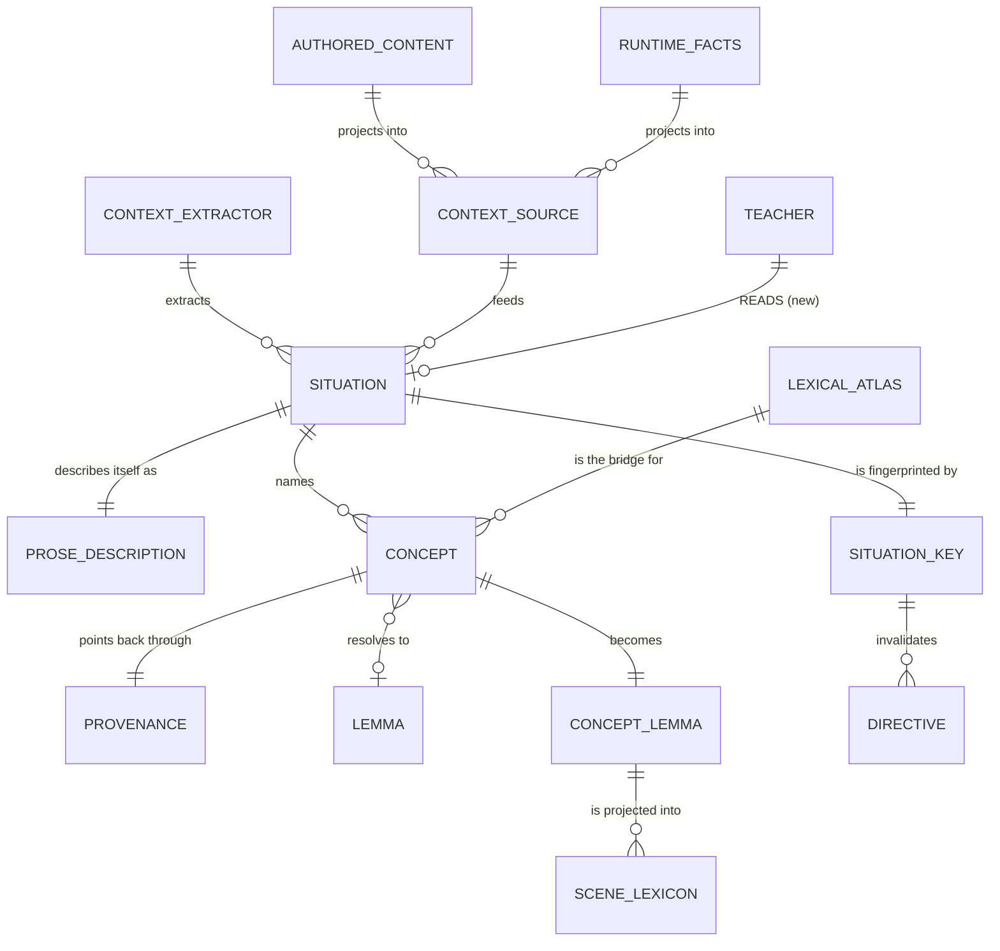
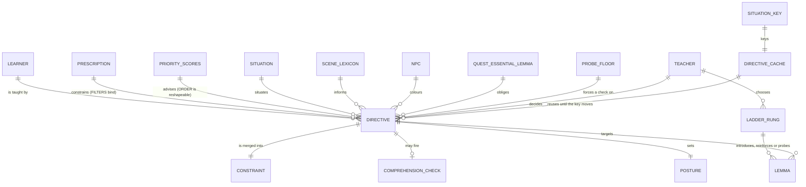
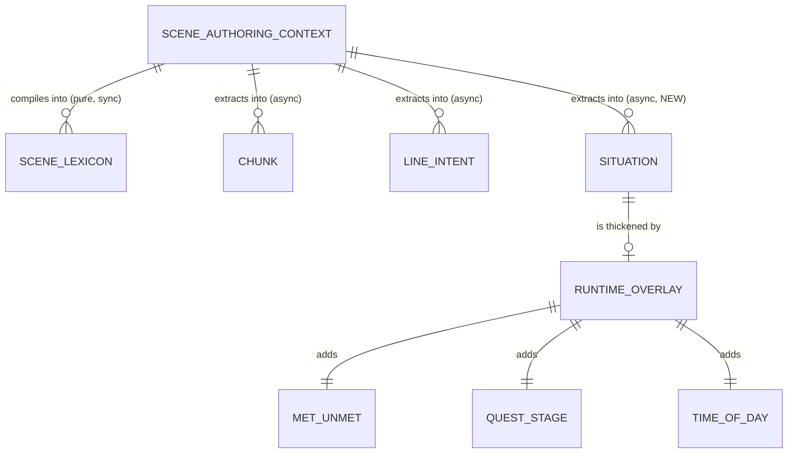

# Sugarlang Domain Model — after Epic 090

Status: PROPOSED. Nothing here is built.
Source: `docs/plans/090-concept-opportunity-scanner-epic.md` (restructured 2026-07-28, epic-review 3 rounds, NOT locked)
Companion: [`domain-model.md`](./domain-model.md) — the model as it exists today

Same domain, same reading convention (*the Teacher decides a Directive*). This
one shows what Epic 090 proposes to add and change.

The headline: **the Teacher gains a `SITUATION` to read.** Everything else is
either what produces that Situation, or what changes downstream once the Teacher
is making a real judgment instead of consuming a pre-sliced list.

---

## What is new

| New entity | Domain meaning |
|---|---|
| `CONTEXT_EXTRACTOR` | One lifecycle-agnostic module. Given sources, extracts a Situation. Does not know whether it is called at compile or at runtime. |
| `CONTEXT_SOURCE` | What it reads. Authored content projects in; live facts project in. Same interface. |
| `SITUATION` | What is going on here: prose description + a list of concepts, each with provenance. |
| `CONCEPT` | An English word plus its part of speech. Support-language, never target-language. |
| `PROVENANCE` | Which authored source a concept came from. |
| `CONCEPT_LEMMA` | A concept resolved to a target lemma through the atlas, stored in a side field and projected into the scene lexicon at read. |
| `SITUATION_KEY` | A fingerprint over (scene, present NPCs, quest stage, time band). Changes invalidate the cached Directive. |

---

## The Teacher, after 090

### The one relationship that matters

`SITUATION ||--o{ DIRECTIVE : "situates"` is the whole epic. Today the Teacher
can see who is speaking and what was just said; it cannot see what this place
is, who else is present, or what a character is *about*. Adding that edge is
what lets a cheese-obsessed NPC teach `queso` instead of quest vocabulary.

### Facts versus judgment

090 splits the Budgeter's output into two edges that behave differently:

| Edge | Binding? | Meaning |
|---|---|---|
| `PRESCRIPTION` -> `DIRECTIVE` | **Binding** | Band envelope, `avoid`, quest-essential exclusions, effective budget. The Teacher may not violate these. |
| `PRIORITY_SCORES` -> `DIRECTIVE` | **Advisory** | The ranking. `introduce` stops being "the answer" and becomes "the default recommendation" — the Teacher may prefer a lower-scored candidate when the situation justifies it. |

That distinction is the point. The scoring function cannot see that the learner
is standing in front of a cheesemonger; the Teacher can.

---

## What changes about existing concepts

| Concept | Change |
|---|---|
| `SCENE_LEXICON` | Gains `conceptLemmas` as a side field, **projected into** `lemmas` at read time. Both are required: storing inside `lemmas` breaks content-hash determinism, but a side field alone never reaches the Budgeter, which only iterates `lemmas`. |
| `DIRECTIVE_CACHE` | Gains a `SITUATION_KEY` digest. Today it invalidates *everything* on any quest or location event, comparing nothing — 090 makes invalidation situation-aware. Precedence against the existing turn-count expiry has to be stated. |
| `TEACHER` vs `SCHEDULE` | The default flips. LLM judgment on situation change becomes primary; the deterministic schedule path becomes the fallback for gateway-down, unchanged situation, or strain-suppressed. This deliberately reverses 087.6. |
| `TEACH_REASON` / `PROBE_TRIGGER_REASON` | Both are closed unions today and must widen — "reinforce ahead of due" and "probe this now" are not currently expressible. |
| `PRESCRIPTION` budget | Becomes an *effective* cap: opening band cap, plus a depth ramp over conversation turns, minus a function-chunk reserve, clamped by strain. |
| `TEACHABLE` slots | Gain rotation. A word prescribed repeatedly but never graded yields its slot, so a full `introduce` list can turn over at all. |

---

## Where the Situation comes from

The Extractor is a **sibling of the compiler, not a dependency of it** — both
consume the same `SceneAuthoringContext`, neither calls the other.

Most of a Situation is compile-derivable — who is placed where, what the place
is, what characters are about. Only met/unmet, quest stage and time of day are
runtime, and all three are cheap deterministic reads. **The dynamic layer is a
thin film over a rich static model.**

---

## Invariants this model must preserve

- **Authors write English.** No authored surface ever requires a target-language
  word. Concepts are English; the atlas is the bridge; a concept that resolves
  to nothing is dropped with telemetry, never invented.
- **One extractor owns context mining**, and it is lifecycle-agnostic. Where it
  is called from is the caller's concern and must not leak into its API.
- **The lexical scrub is not replaced.** Extraction *adds*. Where both find the
  same lemma the projection must merge — union the NPC sources, keep the greater
  weight, retain both provenances. Last-write-wins silently costs the NPC
  affinity boost, which is the exact mechanism that ranks cheese above quest
  words.
- **Facts stay deterministic, judgment stays with the model.** Never ask the
  Teacher to infer something the Budgeter already computed; never let it
  override a filter.

---

## Caveats

This is a proposal, and the epic did **not** converge after three review rounds.
Six decisions are open (see "Open at gate exit" in the plan), and two of them
would change this diagram:

- Whether the Teacher LLM gets its own gateway `purpose` — today it silently
  runs on the cheap dialogue model, which undercuts the whole "the Teacher
  decides" premise.
- Which signal is authoritative for "have they met" — there are already two
  answers that disagree.

Treat the edges above as intent, not as settled contract.
