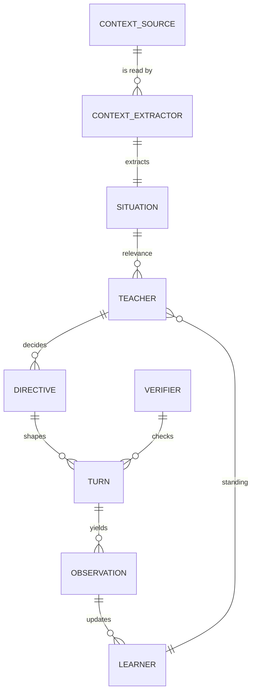
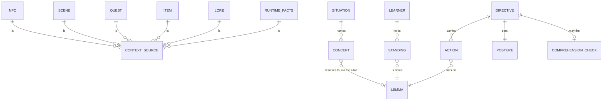
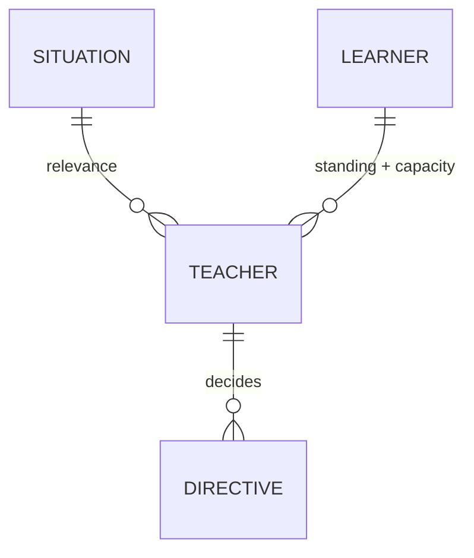

# Sugarlang Domain Model — after Epic 090

Status: PROPOSED. Nothing here is built, and this now goes further than the
written plan (see "What this does to the 090 stories").
Source: `docs/plans/090-concept-opportunity-scanner-epic.md` + whiteboard 2026-07-28
Companion: [`domain-model.md`](./domain-model.md) — the model as it exists today

Same reading convention: *the Teacher decides a Directive*.

---

## The whole thing

Every arrow is one hop; anywhere many things converge, they converge into a
single boundary that distills them.

That last edge closes the loop: what the learner did with a turn becomes the
state the next decision reads. `LEARNER` is both an input to the Teacher and the
thing observations write back to.

### Two kinds of box

Everything on this diagram is an encapsulation boundary — something with
internals worth hiding and few lines crossing it. They come in two kinds, and
the difference matters when reading the arrows:

**Systems** — they own state and/or do work. Each answers one question:

| System | Its one question |
|---|---|
| `CONTEXT_EXTRACTOR` | what is going on here? |
| `LEARNER` | what does this person know, and what can they take? |
| `TEACHER` | what should be taught, and how? |
| `VERIFIER` | was it said correctly? |
| *renderer* | say it |
| *observer* | what did the learner do with it? |

**Artifacts** — what crosses between systems. Also boundaries: each is the
single door for everything behind it.

| Artifact | Produced by | Read by | What it hides |
|---|---|---|---|
| `SITUATION` | extractor | teacher | every content source — NPCs, scene, quests, items, lore, live facts |
| `DIRECTIVE` | teacher | renderer | the whole judgment: actions, posture, glossing, complexity, probe |
| `TURN` | renderer | verifier, observer | the rendered text and its annotations |
| `OBSERVATION` | observer | learner | what the learner did |

`LEARNER` is the one box that is both: a system that owns state, *and* the thing
the Teacher reads. That is why it appears on both sides of the loop.

Note none of this implies a pipeline. `LEARNER` is not a step — it persists
across every turn, is read constantly and written back to. The arrows are data
flow, not lifecycle.

### How to read "inside a boundary"

**This diagram is about domains and encapsulation.** Its boundaries are domain
boundaries. Whether they line up with module boundaries in the code is a
separate question — a happy one when it works out, and not a requirement.

So when this document says FSRS lives "inside `LEARNER`", it is not prescribing
a file layout. FSRS can be its own module, package or service. The claim is
narrower and stronger: **its only conduit into this domain is through
`LEARNER`.** Nothing else in the model asks FSRS anything — the Teacher never
sees it, it sees standing.

Where the two DO line up — a `learner/` module holding the cards, the scheduler
and the capacity rules — take it. Co-locating a domain's internals is genuinely
easier to reason about, and it makes the boundary visible in the tree as well as
in the diagram. Just do not contort the code to force the match, and do not
read a mismatch as a violation. A domain can be assembled from parts that live
anywhere, so long as the conduit holds.

Each boundary is a box you can drill into and find more boxes. That is expected.
The goal is not few boxes inside — it is **few lines crossing the boundary**. A
boundary with fifteen collaborators inside and two edges out is encapsulated.
One with three collaborators and seven edges out is not, and that was the
Budgeter's whole problem: not too big, too *connected*, leaking four concerns
through one badly-named door.

Read a violation this way: if something needs to reach past a boundary to get at
its internals, either the boundary is missing something it should expose, or the
thing reaching is doing a job that belongs inside it.

---

## Inside the boundaries

Internals are shown here rather than in the flow, so the flow stays one line per
hop.

| Boundary | Composed of |
|---|---|
| `SITUATION` | prose description; concepts (+ provenance, + must-comprehend flags); who is present; what this place is; quest stage; time of day; what has been said so far |
| `LEARNER` | band; standing per lemma; capacity (fatigue, session depth, conversation depth); comprehension rate |
| `DIRECTIVE` | actions (introduce/reinforce/probe/skip per lemma); posture; glossing; complexity cap; optional comprehension check; lifetime |

### What deliberately is not in the model

Mechanism, not domain. Each of these was drawn as an entity in an earlier draft
and earned its removal:

| Cut | Why | Now lives as |
|---|---|---|
| `FSRS`, `BAND_ENVELOPE` | *how* standing is computed | inside `LEARNER` |
| `PACING_POLICY`, `CAPACITY` | "how much can this learner take" is a question about the learner | inside `LEARNER` |
| `BUDGETER` | four concerns under one name — see below | split across `SITUATION`, `LEARNER`, `TEACHER` |
| `OBLIGATION` | quest-essential is a flag on a concept | property on `CONCEPT` |
| `SITUATION_KEY`, `DIRECTIVE_CACHE` | caching | lifecycle property of `DIRECTIVE` |
| `CONSTRAINT` | the directive re-expressed for the renderer | adapter on the way to `TURN` |

The test each failed: *does removing it lose a domain fact, or only an
implementation detail?* If a diagram box is answering "how", it belongs inside a
boundary.

Cut here means **cut from the domain model** — not cut from the codebase. FSRS,
the band envelope and the pacing rules are all real code that continues to
exist. They simply do not appear at this level, because at this level nothing
talks to them directly.

---

## Lifecycle — when each thing runs

The domain model says nothing about *when*. It has to, because the cost of
getting this wrong is either latency the player feels or context that is stale
by the time it is used.

Everything distills to one question asked at a turn: **what are the things to
teach right now.** Every earlier moment exists to make that answer cheap.

| Moment | Newly knowable | Computed here | LLM? |
|---|---|---|---|
| **compile** (authoring) | all authored content | concepts + prose per source, cached by content hash | yes, once per content change |
| **game boot** | the bundle | nothing new | no |
| **scene load** | which region, which NPCs actually present, quest stage, time of day | situation overlay onto the cached model | no |
| **NPC proximity** | who the player is walking toward | *pre-warm*: compose the situation, optionally decide the slate | maybe — hidden behind footsteps |
| **conversation start** | met/unmet, this NPC | the **slate** — what this learner should be working on here | yes, once |
| **per turn** | what was just said | usually nothing | **no** |
| **per narrative unit** | this specific text | **realization** — which slate items are present in *this* text | **no** |

### The split that matters: slate vs realization

Two different questions have been answered by one mechanism, and that is the
bug we keep hitting:

| | Question | Scope | Changes when |
|---|---|---|---|
| **SLATE** | what should this learner be working on? | the situation | the situation key moves, or standing changes materially |
| **REALIZATION** | given *this* text, what do I teach with it? | one line / one item body / one description | every piece of text |

A slate is stable across turns. A realization is per text and is **pure
intersection** — no model call, no judgment: *which of my working set actually
appears in, or is about, this text.*

Today these are one thing, and it is why item descriptions rendered in English:
the weave asked the realization question and was handed a slate — and a slate
sliced to the top three, at that. Scene-wide top-N almost never intersects one
specific paragraph.

**The slate must therefore be big enough to be applied to arbitrary text in this
situation** — a working set, not a teaching quota. Roughly: everything relevant
and in-reach here. The *cap* applies at realization, per text, per posture — not
by pre-truncating the slate.

### What that buys

| | LLM calls |
|---|---|
| per content change | 1 per scene (concepts) |
| per conversation | 1 (slate) |
| per situation change | 1 (re-slate) |
| **per turn** | **0** |
| **per rendered line or item** | **0** |

Turns and text realization are deterministic. The only calls ride moments the
player is already waiting through — compiling in Studio, or an NPC's first line.

### Pre-warming

`NPC proximity` is the free win. When the player is walking toward Finnick, the
situation is knowable and the slate can be decided before they press the
interact key. The call is hidden behind footsteps rather than behind a dialogue
box.

That is a scheduling concern, not a domain one — the boundaries do not change.
Worth naming because it is the difference between "one call per conversation" as
a cost and as a felt latency.

### Staleness

Each moment's output survives until the thing it was derived from moves:

| Output | Invalidated by |
|---|---|
| concepts (compile) | content hash change |
| situation overlay | scene change, present-NPC set change, quest stage, time band |
| slate | situation key move, or standing change that crosses a threshold |
| realization | never cached — it is cheap and text-specific |

The situation key is what "the budgeter only gathered context at scene start"
was missing. It is not that context should be gathered more often; it is that
nothing declared when it went stale.

---

## The Teacher, in one line

> **eligible ∩ relevant, ordered by judgment, within what the learner can take.**

**Two inputs. One output.**

Nothing else has a private road to the Teacher, and nothing has a private road
to the Directive. The cap is not a third input — "how many can this learner take
right now" is part of what `LEARNER` reports, alongside what they know.

### Quest-essential vocabulary is a property, not an entity

An earlier draft of this document gave quests a second, private edge into the
Directive — an `OBLIGATION` — on the reasoning that quest-essential rules are
BINDING and binding things must be inputs. Both halves were wrong, and the
result was exactly the reach-around this model exists to remove: `QUEST` is
already a CONTEXT_SOURCE, so it had two roads in.

What quest-essential actually means is one thing: **this word must be
comprehensible right now.** From which both live rules follow — do not gamble on
it as new vocabulary, and always gloss it.

So it is a **flag on a concept the Situation already carries**, not a concept of
its own. The Teacher reads relevance and sees which concepts are must-comprehend.

The same test kills the pacing cap as an entity: "how many new items can this
learner take right now" is a fact about the learner, so it rides `LEARNER`
alongside standing. Enforcement of both lives with the rendered output, not as
extra arrows into the decision.

---

## Standing vs Action — the split that fixes everything

The old model had one concept, `introduce`, that was **named as a verb but
computed as a state**. That is why it read as "the answer" instead of "a fact",
and why every consumer that wanted *eligible words* got *the top five instead*.

| | Owner | Values | Nature |
|---|---|---|---|
| **STANDING** | `LEARNER` | unseen · learning · due · known · out-of-reach | a FACT. `f(FSRS card, band envelope)` |
| **ACTION** | `TEACHER` | introduce · reinforce · probe · skip | a DECISION |

The Teacher's whole procedure is the gating ladder over those two axes:

| standing \ relevance | relevant here | not relevant |
|---|---|---|
| **out-of-reach** | skip | skip |
| **known** | skip (or probe) | skip |
| **due** | reinforce | skip |
| **learning** | reinforce | skip |
| **unseen** | **introduce** | skip |

`introduce`/`reinforce`/`avoid` survive as a mechanism — they are just now
*outputs of a decision* rather than *inputs from a budget*.

---

## Where the Budgeter went

It was four jobs under one name. Every bug this epic exists to fix is one of
them being mistaken for another:

| Job | Now owned by | The bug it caused |
|---|---|---|
| **Sourcing** — where candidates come from | `SITUATION` | — |
| **Eligibility** — is this word in reach | `LEARNER` (standing) | the weave asked for eligible words and got the top-5 slate, so item text rendered as plain English |
| **Ranking** — what is most worth teaching | `TEACHER` | scoring cannot see the learner is stood in front of a cheesemonger |
| **Rationing** — how many at once | `LEARNER` (capacity) | `queso` is eligible, ranks 6th, cap is 5 — pacing silently crowding out relevance |

What is left is one question — *how many new items can this learner take right
now* — answered from fatigue, session depth and conversation depth against the
band's allowance. That is learner state interpreted by a pedagogical rule, and
both halves live inside `LEARNER`. It is not a separate boundary because it does
not transform anything: it reports a number.

The Budgeter's own doc comment always said *"Raw Budgeter output that the
Director reshapes but does not replace."* The code never honoured it. This is
that sentence, taken literally.

---

## `avoid` was two things

Worth calling out because it is a live conflation, not a proposed change:

- **"too hard for you"** — `STANDING = out-of-reach`. Learner side, reaches the
  Teacher as standing.
- **"quest-essential, do not burn it"** — a must-comprehend flag on a concept.
  Situation side, reaches the Teacher as relevance.

They have nothing to do with each other and currently share one list. Neither is
a new entity: one is a value of standing, the other a property of a concept.

---

## Why two inputs is enough

Because both are rich. `SITUATION` and `LEARNER` are composites (see "Inside the
boundaries") — the Teacher is not being starved of detail, it is being given the
detail through two doors instead of nine.

Nothing reaches around them. `NPC`, `SCENE`, `QUEST`, `ITEM` and `LORE` are
CONTEXT_SOURCEs and reach the Teacher only as Situation. FSRS, the band envelope
and the pacing rules reach it only as Learner.

That is the property to defend when this model is extended. A new content kind
is a new CONTEXT_SOURCE, not a new edge to the Teacher. A new signal about the
learner rides `LEARNER`, not a tenth arrow.

---

## What this does to the 090 stories

This model is further than the written plan. Before building, these need
reconciling:

| Story | As written | Under this model |
|---|---|---|
| **090.1** extractor | one lifecycle-agnostic module, compile caller first | Unchanged, and the lifecycle table above is the missing half of it. |
| **090.2** delivery | Project concept lemmas into `sceneLexicon.lemmas` so the *budgeter* sees them | The budgeter is no longer the consumer. Concepts reach the Teacher via the Situation; the projection into `lemmas` may not be needed at all. |
| **090.3** runtime overlay | overlay + situation-change detection | Unchanged and now load-bearing: the situation key is what tells the slate it is stale. |
| **090.4** judgment | "budgeter FILTERS bind, RANKING is advisory" | Collapses. There is no advisory ranking to reshape — the Teacher ranks. Add: the Teacher produces a **slate**, not a per-turn answer. |
| **090.5** effective cap | "strain consume + depth ramp + function reserve" | Right work, wrong home. It is how `LEARNER` reports capacity — and it applies at *realization*, per text, not by pre-truncating the slate. |
| **090.6** stall rotation | rotate words stuck in `introduce` | Largely dissolves. Words stalled because `introduce` was a capped computed state; a slate that is not pre-truncated has nowhere to stall. |
| **new** | — | **Realization** is missing from the epic entirely: the per-text intersection step. It is where today's item-description bug actually lives. |

Two observations from the lifecycle work:

**090.6 exists because of the conflation.** Words got stuck in `introduce`
precisely because `introduce` was a computed state with a cap rather than a
decision. Fix the decomposition and the stall has nowhere to happen.

**The epic has no story for realization.** Every story is about producing better
inputs to the decision; none is about applying the decision to a specific piece
of text. That gap is exactly where the weave failed on item bodies, and it will
fail the same way on scripted dialogue at A1 until it is named.

---

## Still unresolved

- Where `PROBE` sits. It is an ACTION, but its trigger is partly floor-based
  (time since last probe) which is capacity-shaped, not relevance-shaped.
- Whether capacity is one rule or per-band rules, and whether it belongs on
  `LEARNER` at all or is pedagogy that happens to read learner state.
- The six open decisions from the epic-review gate still stand, including that
  the Teacher LLM currently runs on the cheap dialogue model.
