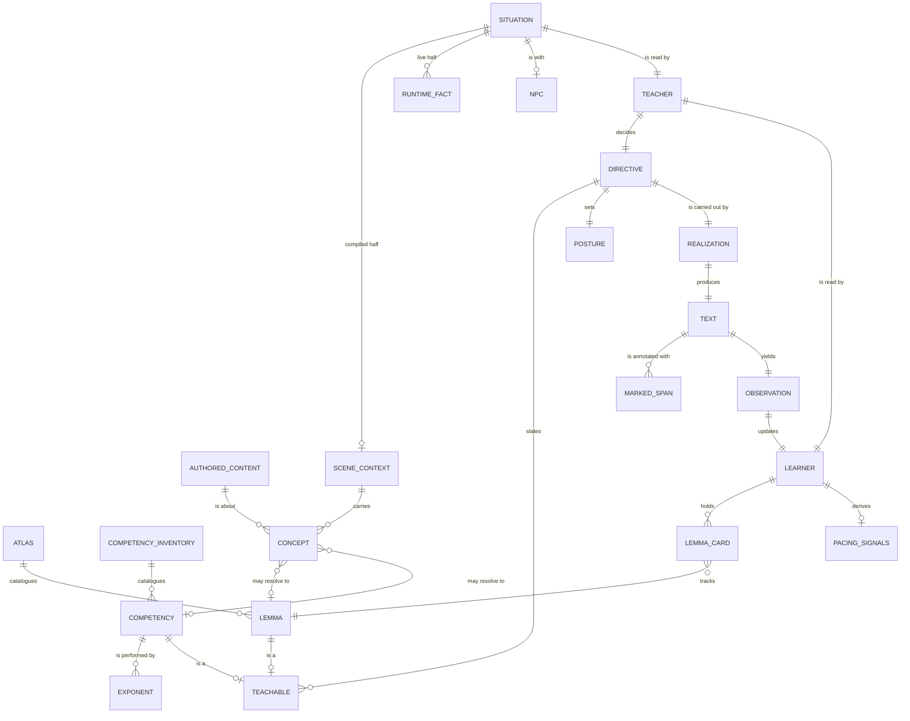

# Sugarlang Domain Model

Status: active
Last verified against code: 2026-07-31 (end of Epic 090)

How the pieces fit together. For definitions of individual nouns, see
[domain-terms.md](./domain-terms.md); for the runtime sequence that takes a
player from walking up to an NPC to reading a line, see
[conversation-flow.md](./conversation-flow.md).

Deliberately not a module diagram: several of these entities are produced by
more than one module, and a few modules produce nothing that belongs here at
all. If this document and the code disagree, the code is right and this is
stale.

---

## What sugarlang is

A language-teaching layer over an ordinary adventure game. The player plays the
game; sugarlang decides what each line of dialogue should teach them, and shapes
the text so it teaches it.

Everything below serves one decision, made once per conversation:

> Given this situation and this learner, what should the next thing they read
> try to teach?

That decision is a **directive**. Everything upstream of it gathers evidence;
everything downstream carries it out.

---

## The whole model



Read the relationship labels as sentences: *the Teacher decides a Directive*,
*a Concept may resolve to a Lemma*.

---

## The two doors

The Teacher is handed exactly two kinds of content, and the split is the spine
of the model:

```
SITUATION  --  what is true out in the world right now
LEARNER    --  what is true about this person right now
```

`TeacherContext` (`runtime/contracts/providers.ts`) has those two fields plus
plumbing: `conversationId`, `situationKey`, `atlas`, `lang`,
`calibrationActive`, `telemetryContext`. There is no third content door. When
something new needs to reach the Teacher it goes through one of the two, and
which one is a real question with a real answer: *is this a fact about the
world, or a fact about the person?*

The doors were once nine parallel fields. Scene, NPC, recent turns, pending
lemmas, probe floor state, quest-essential lemmas, selection metadata and
prescription each arrived on their own channel, so every new signal invented its
own and nothing could be reasoned about as a whole.

### SITUATION

`Situation` (`runtime/situation/situation.ts`) is one scene at one moment, with
two halves of very different lifetimes:

| half | what it is | lifetime |
|---|---|---|
| `sceneContext` | `SceneContextModel` -- what this scene is ABOUT | compiled, cached on content hash |
| `runtime` | quest objectives, quest stage, tracked quest, time of day, known facts, world events | this instant |

plus the conversational surface: `npc`, `recentTurns`, `turnsSinceLastProbe`.

`composeSituation` (`runtime/situation/compose.ts`) builds it and is **total**
-- it always returns a `Situation`, never null. Absence is represented inside
the structure, not by the structure's absence.

`situationKey` (`runtime/situation/situation-key.ts`) is what the directive
cache is keyed on. The conversational surface is deliberately excluded from it:
recent turns change every turn, and including them would mean no cache hit ever.

### RuntimeFact, and why (unknown) is not (none)

Every runtime fact is a `RuntimeFact<T>` (`runtime/situation/runtime-fact.ts`):
available with a value, or unavailable.

The distinction is load-bearing and easy to erase by accident. "The player has
no active quest" and "we could not read the quest system" are different facts
about the world, and a Teacher that cannot tell them apart will confidently
teach into a void it believes is empty. They render as different words in the
prompt -- `(none)` and `(unknown)` -- for exactly this reason.

### LEARNER

`LearnerProfile` (`runtime/learner/learner-profile.ts`) -- the estimated band,
the CEFR posterior, and one `LemmaCard` per word the learner has met, carrying
review count, stability and retrievability.

The profile is **stored**. Nearly everything the Teacher reads about pacing is
**derived from it on demand** rather than kept alongside it:

- `computePacingSignals` (`runtime/learner/pacing-signals.ts`) -- pending
  provisional lemmas, probe floor state
- `getLearningStatus` (`runtime/learner/learning-status.ts`) -- `unseen`,
  `learning`, `due`, `known`, `out-of-reach`
- `resolveQuestEssentialLemmaRefs` (`runtime/teacher/quest-essential.ts`)
- `resolveSceneTeachables` (`runtime/contracts/scene-teachable.ts`)

Derived-not-stored is a deliberate rule. Stored state must be persisted,
migrated and kept honest across a save/load, and each of these is cheap to
recompute. An earlier generation persisted session counters; they came back from
a save file looking hours old and tripped every cooldown heuristic reading them.

`getLearningStatus` is what turns a card into an action:

| status | what the Teacher does with it |
|---|---|
| `unseen` | candidate to **introduce** |
| `due` | candidate to **reinforce** |
| `out-of-reach` | **avoid** |
| `learning`, `known` | neither -- in flight, or finished |

---

## Supply and demand

The central asymmetry, and the thing most worth understanding:

> **A concept is DEMAND. A teachable is SUPPLY.**

A **concept** is what a piece of content is about, or does -- an English word
with a part of speech and a provenance, inferred from authored prose by a model
during compilation:

```jsonc
{ "word": "cheese", "pos": "noun", "provenance": "npc:finnick:bio" }
```

A concept says *"this is relevant here"* and nothing about what to teach. It has
no kind. Resolution looks it up in two independent supply tables:

| concept | atlas (vocabulary) | competency inventory |
|---|---|---|
| `cheese` | `queso` | -- |
| `greeting` | `saludo` | `greet` |
| `self introduction` | -- | `introduce-self` |

It may hit both, one, or neither. A miss is information rather than an error: a
phrase that misses the atlas is precisely the signal to try the other table.

### The two supply tables are not alike

Easy to get wrong, because both produce `Teachable`s and look symmetric. They
are not:

- The **atlas** is a lookup. `cheese` -> `queso` is mechanical, and the code
  does it. `LexicalAtlasProvider`, backed by
  `data/languages/<lang>/cefrlex.json` -- 11,000 entries in Spanish.
- The **competency inventory** is a menu. Judging that this moment is a chance
  to practice introducing yourself is pedagogy, and the code does not do it --
  the Teacher chooses from the inventory
  (`data/languages/<lang>/competency-inventory.json`).

So concepts reach the Teacher as *concepts*, not pre-resolved into a shortlist.
The Teacher sees what the scene is about and picks; it is not handed a
prescription to rubber-stamp.

That was, for a long time, exactly backwards. A Lexical Budgeter scored the
scene's words and prescribed a shortlist; the Teacher's job was to accept it.
The failure that ended it: an NPC obsessed with cheese never taught `queso`,
because his lines are generated at runtime, so "cheese" was never in authored
text for a word-scan to find. Scoring the words that happen to be *present*
cannot reach a word that is merely *relevant*. The budgeter and
`LexicalPrescription` are deleted; `runtime/contracts/lexical-prescription.ts`
survives only as the home of `LemmaRef`.

### Teachables

`Teachable` is the umbrella over both supply tables. Two kinds today
(`TEACHABLE_KINDS`, `runtime/contracts/scene-teachable.ts`):

- **vocabulary** -- one word. `cheese` -> `queso`.
- **competency** -- one communicative act. *"Can introduce yourself"*,
  performed by its **exponents**: `me llamo`, `mi nombre es`, `mucho gusto`.

A competency is language-neutral; only its exponents are per-language. A
competency counts as ONE item against the learner's capacity -- its exponents
are how the act is performed, not extra things to learn.

---

## The decision

The Teacher (`runtime/teacher/`) reads the two doors and returns a
`PedagogicalDirective`:

- a **slate** -- what to `introduce`, `reinforce`, `avoid`
- a **posture** and **target-language ratio** -- how much of the line is in the
  target language
- a **sentence complexity cap**
- whether to run a comprehension probe

Two policies produce one: an LLM policy, and a deterministic fallback for when
the gateway is unavailable. Results are cached per conversation by
`DirectiveCache`, keyed on `situationKey`.

### The envelope

Band-keyed pedagogical limits live in exactly one file,
`runtime/teacher/band-envelope.ts`, because every one of them has at some point
existed in two places with different numbers:

| what | source of truth |
|---|---|
| target-language ratio per posture | `TARGET_LANGUAGE_RATIO_BY_POSTURE` |
| how far the Teacher may lean off it | `clampRatioToPosture` |
| new teachables per turn, by band | `getIntroduceCapForBand` (A1:3 A2:4 B1:5 B2:5 C1:6 C2:6) |
| sentence complexity ceiling | `getSentenceComplexityCap` |
| band -> posture | `postureForBand` |
| how to *tell a model* how much target language to use | `describeLanguageMix` |

The last one is a table only in spirit, and it belongs here for the same reason
as the rest. The build-time bake and the runtime generator both have to phrase
that instruction, and they had drifted to contradiction: the bake told every
band to write "predominantly or entirely in the target language" while the
envelope said 30% for A1. The ratio reached the *verifier* and never the
*generator*, so A1 lines came out fully in Spanish -- and looked deliberate.

---

## Realization

**Realization** turns a directive into text. It is one operation performed at
two moments, and the only difference is *when*:

| | build time | runtime |
|---|---|---|
| what | authored dialogue lines | agent-generated NPC lines |
| where | `runtime/compile/generate-variant.ts` -> `runtime/grading/graded-text-service.ts` | `runtime/middlewares/generator-prompt-overlay.ts` |
| result | a **variant**, cached per `{lang, band, contentHash, promptVersion}` | text generated in the moment |

Note there is no learner in the variant cache key: a variant is per-band, not
per-person.

The intent is that both paths shape a *generator* -- the target language is
written by the model that writes the line, at whatever ratio the posture
directs. Nothing should substitute words into already-finished text.

**One survival, still live.** When the scripted path misses the variant cache it
falls back to `applyWeave` (`runtime/middlewares/sugar-lang-scripted-middleware.ts`),
which calls `markGradedText` and assigns the result back to the turn text --
substitution, on authored English, at runtime. The dedicated
`runtime/classifier/diglot-weave.ts` module is deleted; this caller is what is
left of it. It is a fallback, so it only fires on a cache miss, which is exactly
what makes it easy to miss.

`markGradedText` is doing two jobs here -- marking and substituting -- and only
the marking half belongs in the finished design.

---

## Presentation

Realization produces text; presentation marks it up so the player can see what
is being taught. `markGradedText` (`runtime/grading/graded-text-marker.ts`)
annotates only -- it never rewrites. Two kinds of span:

- **slate terms** (`findTermMatches`) -- what the Teacher asked this line to
  teach. These carry the gold/blue treatment and the celebrate animation.
- **ambient spans** (`findAmbientSpans`, `runtime/grading/ambient-spans.ts`) --
  target-language words the atlas knows that nobody asked for. Deliberately not
  styled.

Marker roles are `focus | recall | challenge | ambient | unmarked`. `unmarked`
means *explicitly nothing*, and must never be a fallback for "we could not work
out a role" -- that silently converts a bug into a valid state.

The player can select any target-language span to see it translated
(`lookupSelection`, `runtime/grading/lookup-selection.ts`), which returns `null`
for every expected miss rather than guessing.

**Ambient spans currently dead-end.** The observe middleware writes them onto
the `dialogueHighlight` annotation, but `readDialogueHighlight`
(`packages/runtime-core/src/dialogue/highlight.ts`) does not copy the field into
its return value, so nothing downstream can see them. Select-to-translate works
without them -- it resolves the raw selected string through the atlas -- so the
player-facing feature is fine and the span data simply has no reader yet.

---

## Observation

After a turn, `applyObservation` (`runtime/learner/observations.ts`) folds what
happened back into the profile: which lemmas were seen, which were produced,
which comprehension checks passed. That updates the cards the next
`getLearningStatus` call will read.

This closes the loop -- the profile the Teacher read at the start of the
conversation is the profile this turn just changed.

---

## Invariants

The rules that keep biting when broken.

**One enforcer per behavior.** Every band-keyed number lives in
`band-envelope.ts`. Two tables that agree today will disagree in six weeks, and
the divergence is invisible: both paths look correct in isolation, and only one
runs at a time.

**Composition is total.** `composeSituation` always returns a `Situation`.
Missing data is `unavailable()` inside it, never a null situation.

**(unknown) is not (none).** Preserve the distinction all the way to the prompt.

**A concept has no kind.** It is demand. Anything that pre-resolves concepts
into a shortlist before the Teacher sees them has reinvented the budgeter.

**Never drop a Teacher-named lemma the atlas does not know.** The atlas is an
incomplete dictionary; a Spanish word missing from it is a gap in our lexicon,
not an invented word. Dropping it lets a limited dictionary veto a sound
pedagogical judgment and leaves the line with less to teach, for no gain. Emit
telemetry instead -- a word the curriculum reached for and the dictionary could
not answer is a good signal for what the lexicon should grow to include.

**Authoring failures do not reach players.** A stale scene context is an
authoring problem and it surfaces in Studio. The person on the other end is
playing a game; they see an error only if the game cannot continue or data would
be lost.

**Presentation adds, never reshapes.** New span kinds go alongside the existing
highlight annotation fields, not through them. The gold/blue styling and the
celebrate animation are load-bearing player-facing behavior.
