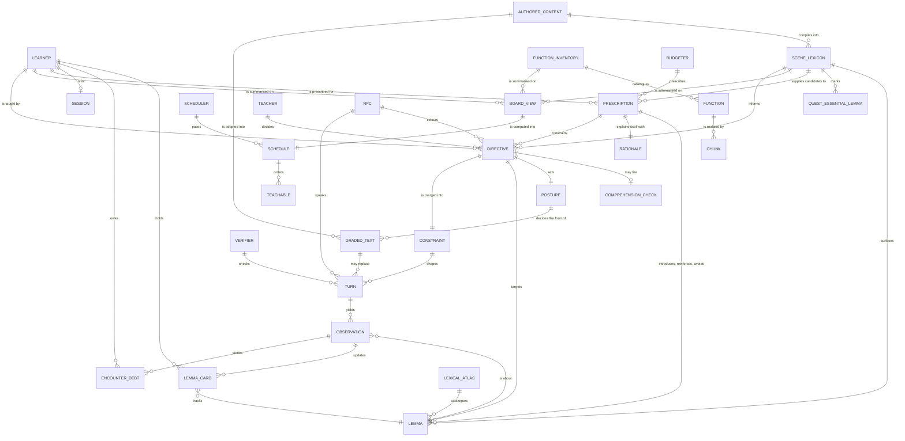
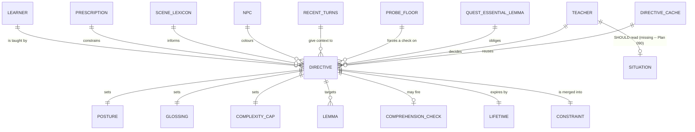

# Sugarlang Domain Model

Status: active
Last verified against code: 2026-07-28

The sugarlang plugin at the DOMAIN level -- the concepts the teaching model is
written in, and who produces what. Deliberately not a class or module diagram:
several of these entities are produced by more than one module, and a few
modules produce nothing that belongs here at all.

Read the relationship labels as sentences: *the Teacher decides a Directive*,
*the Budgeter prescribes a Prescription*.

---

## The whole model

---

## The Teacher, specifically

The Teacher is the decision-maker. Everything below it is either an input it
reads or an output it is responsible for.

### What the Teacher reads

| Input | Domain meaning |
|---|---|
| `LEARNER` | Who this is: band, cards, confidence, fatigue |
| `PRESCRIPTION` | What the Budgeter says is teachable here, ranked |
| `SCENE_LEXICON` | What vocabulary this scene contains at all |
| `NPC` | Who is speaking |
| `RECENT_TURNS` | What has just been said |
| `PROBE_FLOOR` | Whether a comprehension check is overdue |
| `QUEST_ESSENTIAL_LEMMA` | Words the quest cannot proceed without |

### What the Teacher decides

One `DIRECTIVE` per decision, carrying posture, interaction style, glossing
strategy, sentence-complexity cap, target vocabulary, an optional comprehension
check, and a lifetime. The Directive is then merged into a `CONSTRAINT`, which
is what actually reaches the generator.

---

## Three things worth knowing

**1. The Teacher and the Scheduler are alternatives, not a pipeline.**
`SCHEDULE` and `DIRECTIVE` both answer "what should this turn teach". The
scheduler-driven path deliberately bypasses the Teacher for cost and
determinism; the Teacher path calls a model. They meet at `CONSTRAINT`.

**2. The Teacher is runtime-only, and that is forced.**
Its question is "what is worth teaching THIS learner right now". At compile time
there is no learner -- graded text is produced per BAND, not per person. So
`GRADED_TEXT` has no edge to `TEACHER`: it is the *rendering* half, precomputed
where precomputation is possible.

**3. `SITUATION` does not exist yet.**
The Teacher can see who is speaking and what was just said, but not what this
place *is*, who else is present, or what the moment is about. That missing
entity is the whole subject of Plan 090, and it is why a cheese-obsessed NPC
teaches quest vocabulary instead of `queso` -- nothing in the model above can
express "this character is about cheese" unless an author wrote the literal
word.

---

## Where these live

| Domain concept | Contract |
|---|---|
| `LEARNER`, `LEMMA_CARD`, `SESSION` | `contracts/learner-profile.ts` |
| `LEMMA`, `LEXICAL_ATLAS` | `contracts/providers.ts`, atlas data |
| `SCENE_LEXICON`, `QUEST_ESSENTIAL_LEMMA` | `contracts/scene-lexicon.ts` |
| `FUNCTION`, `CHUNK`, `FUNCTION_INVENTORY` | `contracts/function-inventory.ts` |
| `PRESCRIPTION`, `RATIONALE` | `contracts/lexical-prescription.ts` |
| `SCHEDULE`, `TEACHABLE` | `scheduler/teach-schedule.ts` |
| `BOARD_VIEW` | `scheduler/scheduler-board-view.ts` |
| `DIRECTIVE`, `POSTURE`, `GLOSSING`, `COMPREHENSION_CHECK`, `CONSTRAINT` | `contracts/pedagogy.ts` |
| `OBSERVATION` | `contracts/observation.ts` |
| `ENCOUNTER_DEBT` | `learner/encounter-debt-ledger.ts` |
| `GRADED_TEXT` | `contracts/graded-text.ts` |
| `TEACHER` | `teacher/sugar-lang-teacher.ts` |
| `BUDGETER` | `budgeter/lexical-budgeter.ts` |
| `SCHEDULER` | `scheduler/outer-loop-scheduler.ts` |
